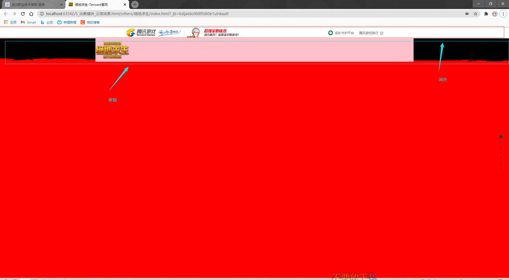
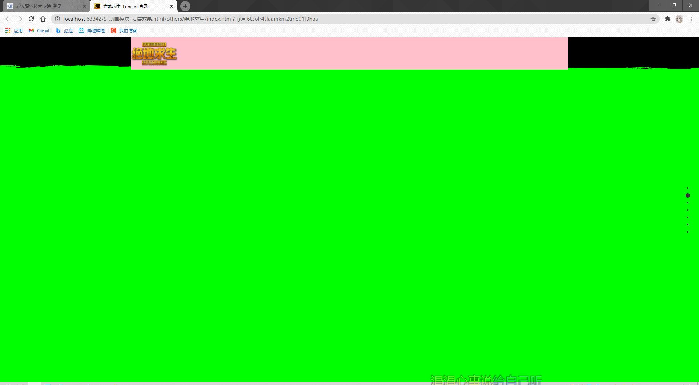

效果如图:

滚动后:


需要监听滚动,并控制两个标题栏的样式,此处是用fullpage来实现:
html结构:
```html
<body>
<!--第一个滚动消失的标题栏-->
<div class="toolbar"></div>
<!--第二个滚动滞留顶部的标题栏-->
<div class="nav"></div>

<div id="fullpage">
<!--内容-->
</div>
</body>
```

js中的步骤:
拿到需要控制的元素 -->fullpage中的onLeave函数监听是否为第一屏,是将第一个标题display设为block第二个标题距离顶部高度不为0,
<br>不是,将第一个标题display设为none,第二个标题距离顶部的高度设为0


上js的代码(主要看onLeave中的代码):
```javascript
window.onload = function () {
    //1.拿到需要操作的元素
    let oToolbar = document.querySelector(".toolbar")
    let oNav = document.querySelector(".nav")

    new fullpage('#fullpage', {
        sectionsColor: ['#f00', '#0f0', '#00f', '#ff00', '#0ff', '#f0f', '#000'],
        // 控制section文字是否上下居中
        verticalCentered: false,
        //显示小圆点
        navigation: true,
        //实现无限循环滚动
        loopTop: true,
        loopBottom: true,
        //实现监听向下滚动
        onLeave: function (origin, destination, direction) {
            //destination:滚入的这一屏的数据
            // isFirst:是否为第一屏
            if (destination.isFirst) {
                oToolbar.style.display = 'block';
                oNav.style.top = '42px';
            } else {
                //不是第一屏
                oToolbar.style.display = 'none';
                oNav.style.top = '0px';
            }
        }
    });
}
```
