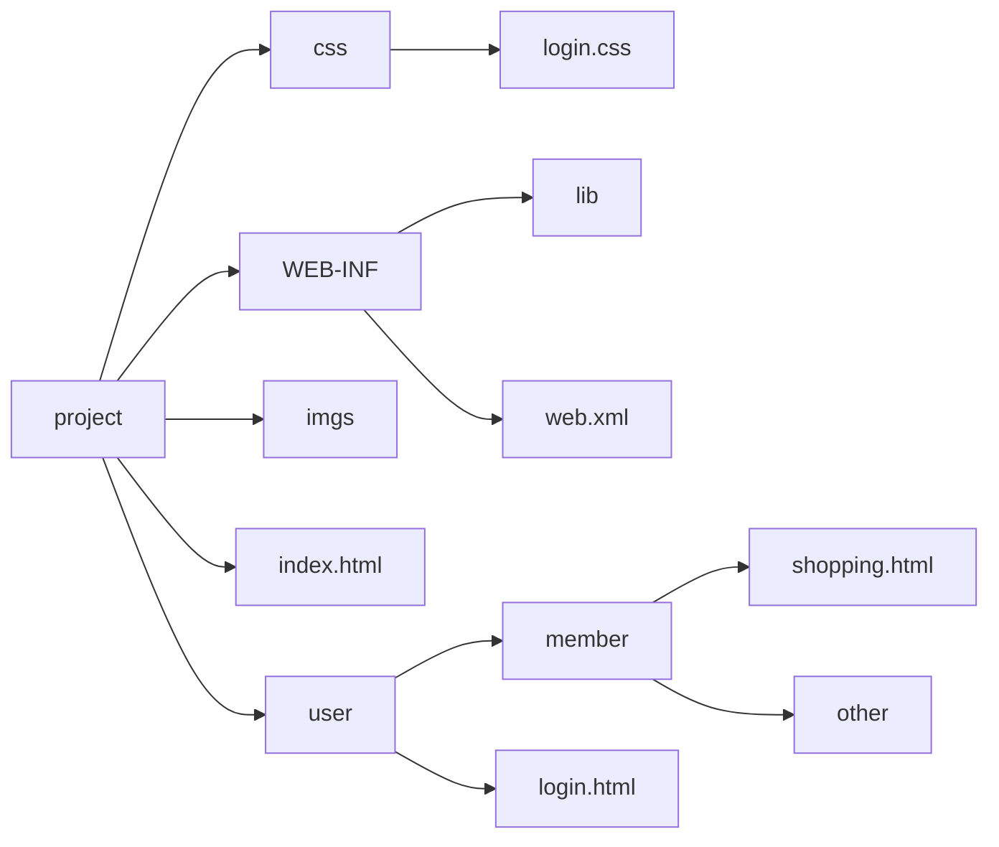

### appliation作用域

session是由作用域的,在一次会话范围内容有效

而application作用域是在服务器应用上,是公共访问的

#### 测试:

例如写了下面两个servlet:

```java
package com.demo;

import javax.servlet.ServletContext;
import javax.servlet.ServletException;
import javax.servlet.annotation.WebServlet;
import javax.servlet.http.HttpServlet;
import javax.servlet.http.HttpServletRequest;
import javax.servlet.http.HttpServletResponse;
import java.io.IOException;

@WebServlet("/demo01")
public class servlet01 extends HttpServlet {
    @Override
    protected void service(HttpServletRequest req, HttpServletResponse resp) throws ServletException, IOException {
        ServletContext application = req.getServletContext();
        application.setAttribute("uname", "demo01设置了");
        //重定向
//        resp.sendRedirect("demo02");
        Object unameObj = application.getAttribute("uname");
        System.out.println("unameObj= " + unameObj);
    }
}
```

```java
package com.demo;

import javax.servlet.ServletContext;
import javax.servlet.ServletException;
import javax.servlet.annotation.WebServlet;
import javax.servlet.http.HttpServlet;
import javax.servlet.http.HttpServletRequest;
import javax.servlet.http.HttpServletResponse;
import java.io.IOException;

@WebServlet("/demo02")
public class servlet02 extends HttpServlet {
    @Override
    protected void service(HttpServletRequest req, HttpServletResponse resp) throws ServletException, IOException {
        //Servlet上下文,在应用停止时,才会结束
        ServletContext application = req.getServletContext();
        application.setAttribute("uname", "demo02设置了");
        Object unameObj = application.getAttribute("uname");
        System.out.println("unameObj= " + unameObj);
    }
}
```

访问不同的servlet,他们为其设置不同的`application`:


### 保存作用域:

原始情况下,保存作用域我们可以认为有四个:page(页面级别,现在几乎不用),request(一次请求`响应范围)

- request:一次请求响应范围
- session:一次会话范围
- application:一次应用程序范围有效

### 路径问题:
- 相对路径
- 绝对路径

项目路径可能像下面这种



login.html想要引用css文件夹下的login.css

这里就有相对路径和绝对路径的link写法:

- ../css/login.css
- http://localhost:8080/project/css/login.css

但是我们在使用时,推荐使用绝对路径

##### 问题:

例如在下面的一个页面中:

```html
<html xmlns:th="http://www.thymeleaf.org">
<head>
    <meta charset="utf-8">
    <link rel="stylesheet" href="css/index.css">
</head>
<body>
<div id="div_container">
    <div id="div_fruit_list">
        <p class="center f30">欢迎使用水果库存后台管理系统</p>
        <table id="tbl_fruit">
            <tr>
                <th class="w20">名称</th>
                <th class="w20">单价</th>
                <th class="w20">库存</th>
                <th>操作</th>
            </tr>
            <tr th:if="${#lists.isEmpty(session.fruitList)}">
                <td colspan="4">对不起，库存为空！</td>
            </tr>
            <tr th:unless="${#lists.isEmpty(session.fruitList)}" th:each="fruit : ${session.fruitList}">
                <td><a href="@{edit.do}" th:text="${fruit.fname}">苹果</a></td>
                <td th:text="${fruit.price}">5</td>
                <td th:text="${fruit.fcount}">20</td>
                <td></td>
            </tr>
        </table>
    </div>
</div>
</body>
</html>
```

这里为苹果添加了a标签:`<td><a href="@{edit.do}" th:text="${fruit.fname}">苹果</a></td>`

这样点击之后的访问路径是:`http://localhost:8080/project/当前页面/edit.do`

但是我们也可以为其这是访问绝对路径,将这段代码改为(当然这不是最终写法):

`<td><a th:href="@{'/edit.do?fid='+${fruit.fid}}" th:text="${fruit.fname}">苹果</a></td>`

即可,这里`?fid=fruit.fid`是发起get请求时,携带的fid

最终的写法:

`<td><a th:href="@{/edit.do(fid=${fruit.fid})}" th:text="${fruit.fname}">苹果</a></td>`

而这里的th:href是为了方便,无论你的路由多深,它会自动为其添加前面的路由

### 元素便利省略对象前缀:

在原来我们渲染页面可能使用:

```html
        <table id="tbl_fruit">
            <tr>
                <th class="w20">名称</th>
                <th class="w20">单价</th>
                <th class="w20">库存</th>
                <th>操作</th>
            </tr>
            <tr th:if="${#lists.isEmpty(session.fruitList)}">
                <td colspan="4">对不起，库存为空！</td>
            </tr>
            <tr th:unless="${#lists.isEmpty(session.fruitList)}" th:each="fruit : ${session.fruitList}">
                <!--<td><a th:href="@{'/edit.do?fid='+${fruit.fid}}" th:text="${fruit.fname}">苹果</a></td>-->
                <td><a th:href="@{/edit.do(fid=${fruit.fid})}" th:text="${fruit.fname}">苹果</a></td>
                <td th:text="${fruit.price}">5</td>
                <td th:text="${fruit.fcount}">20</td>
                <td></td>
            </tr>
        </table>
```

像是`${fruit.fname}`这种方法来渲染页面,但是每个渲染的item都要写`fruit`这个前缀,这里是可以省略的:

```html
        <form th:action="@{/fruit.do}" method="post" th:object="${fruit}">
            <input type="hidden" name="operate" value="update">
            <!-- 隐藏域 ： 功能类似于文本框 ， 它的值会随着表单的发送也会发送给服务器，但是界面上用户看不到 -->
            <input type="hidden" name="fid" th:value="*{fid}"/>
            <table id="tbl_fruit">
                <tr>
                    <th class="w20">名称：</th>
                    <!-- <td><input type="text" name="fname" th:value="${fruit.fname}"/></td> -->
                    <td><input type="text" name="fname" th:value="*{fname}"/></td>
                </tr>
                <tr>
                    <th class="w20">单价：</th>
                    <td><input type="text" name="price" th:value="*{price}"/></td>
                </tr>
                <tr>
                    <th class="w20">库存：</th>
                    <td><input type="text" name="fcount" th:value="*{fcount}"/></td>
                </tr>
                <tr>
                    <th class="w20">备注：</th>
                    <td><input type="text" name="remark" th:value="*{remark}"/></td>
                </tr>
                <tr>
                    <th colspan="2">
                        <input type="submit" value="修改" />
                    </th>
                </tr>
            </table>
        </form>
```

只要在父级元素加:`th:object="${fruit}"`即可,其中的子元素渲染item时,只需填入对应的key即可:`th:value="*{remark}"`

但是要注意,它渲染的范围只有他的子标签范围内


#### 省略字符串拼接;

在使用`thymeleaf`时,会遇到一些动态的字符串拼接,除了使用`''`来包裹将要渲染的字符串之外,还可以使用`|`来包裹,例如:

```html
<td></td>
```

这里是将`|`包裹的内容自动识别并渲染


