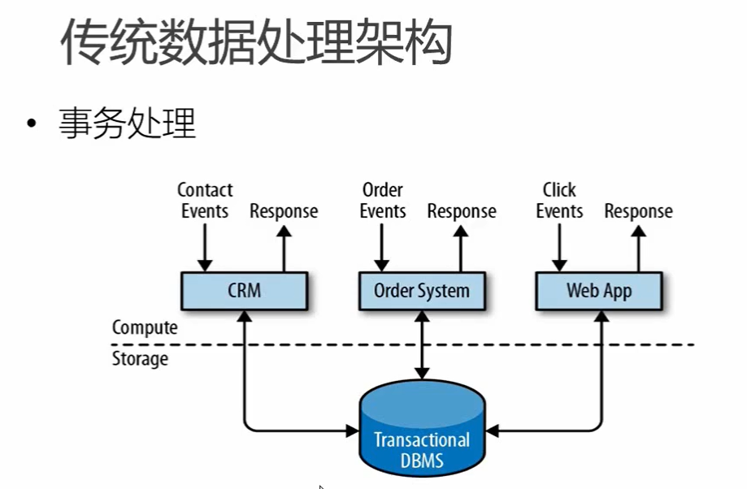
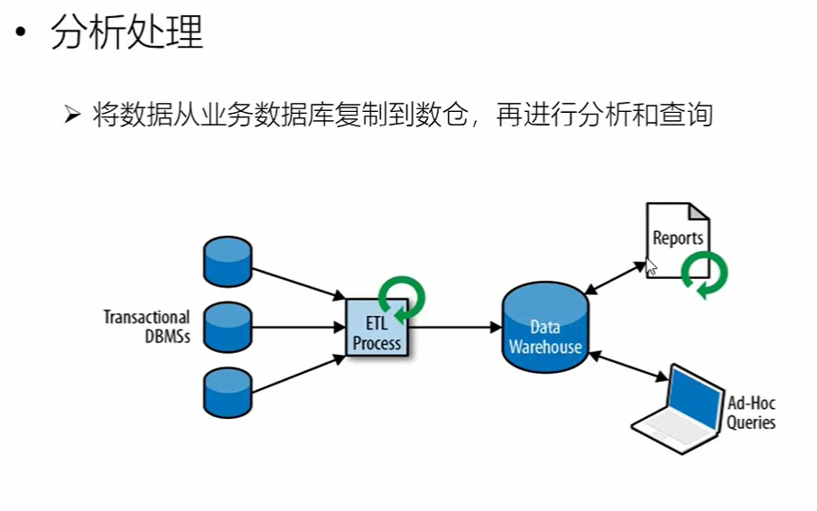
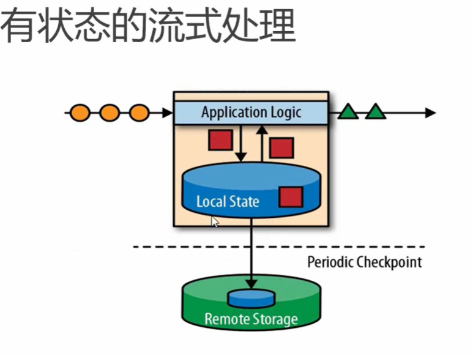
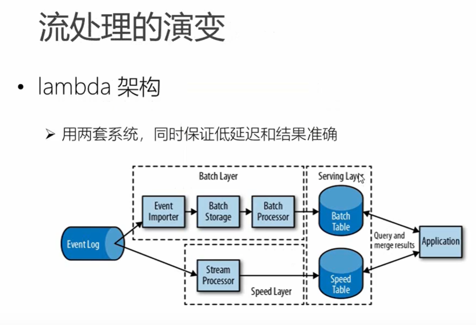
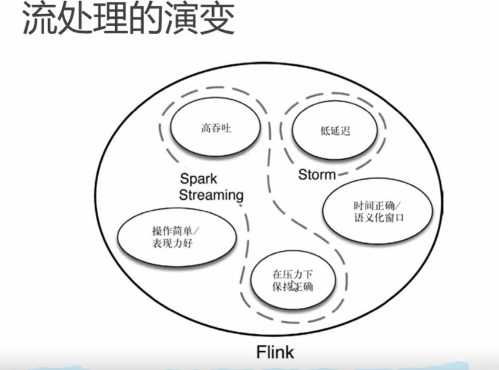
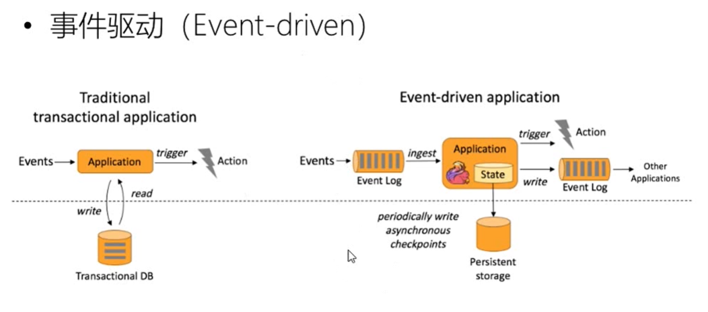
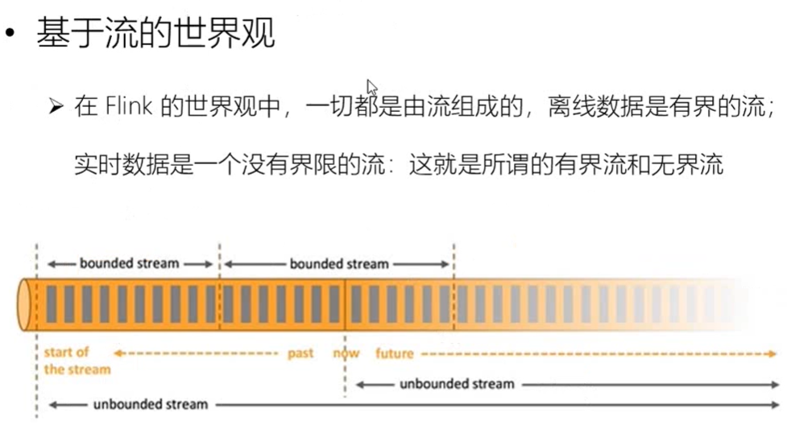
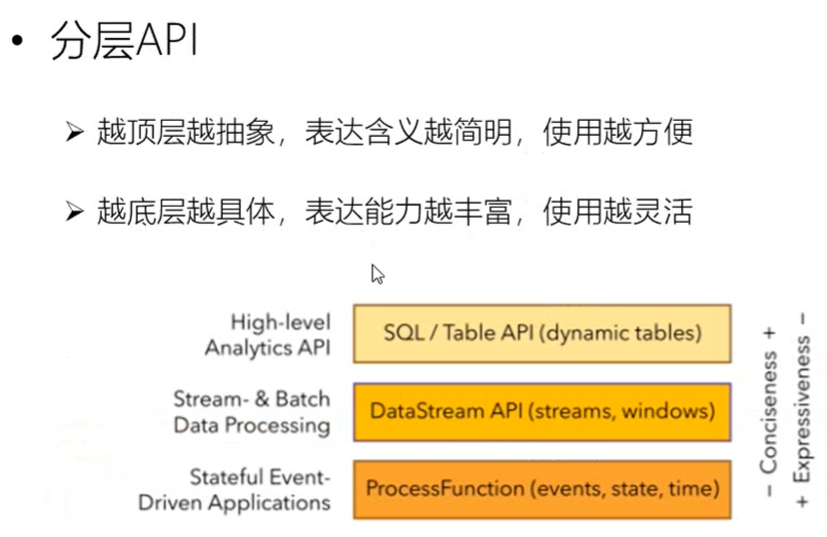
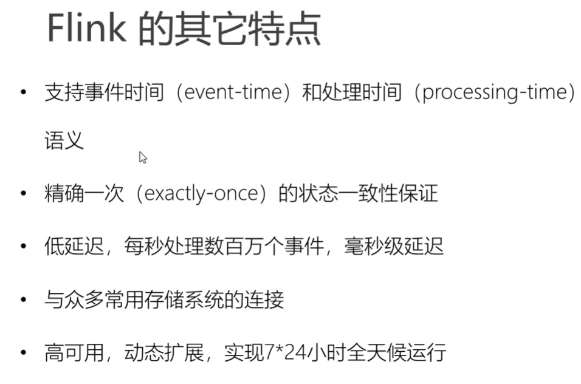
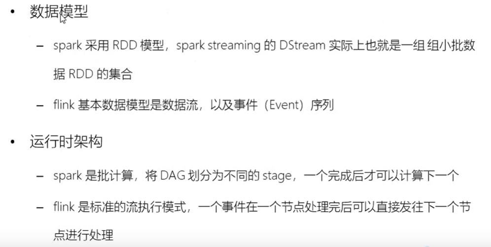

* 1:传统的数据处理架构

传统的数据处理架构中,程序需要一直出于运行状态

由`Contact Events`(事件)驱动,事件被传递给`CRM`(客户管理系统),并返回Response.在事件驱动的同时,会传递给`DMBS`数据管理系统.

* 分析处理:

* 有状态的流处理

* 流处理的演变

* 流处理的演变

* 事件驱动

* 基于流的世界观

* 分层API

* Flink的其他特点

* Flink VS Spark Streaming

* 数据模型

