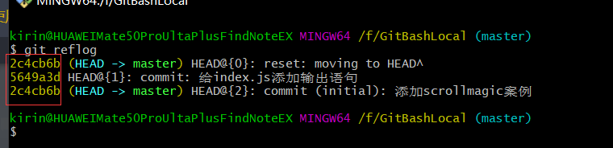

[官网](https://git-scm.com/)  

---

* 查看git版本(这个是cmd中使用)验证是否安装git:  
> git --version  

---

* 在gitBash中查看可以输入的命令:
> git help

---


[学习git的中文网站](https://backlog.com/git-tutorial/cn/)  

---

* 初始化git:  
在一个空的文件夹,右键-->git bash here
> git init

---

* 查看当前git的配置:  
> git config -l
```
kirin@HUAWEIMate50ProUltaPlusFindNoteEX MINGW64 /f/GitBashLocal (master)
$ git config -l
diff.astextplain.textconv=astextplain
filter.lfs.clean=git-lfs clean -- %f
filter.lfs.smudge=git-lfs smudge -- %f
filter.lfs.process=git-lfs filter-process
filter.lfs.required=true
http.sslbackend=openssl
http.sslcainfo=C:/Program Files/Git/mingw64/ssl/certs/ca-bundle.crt
core.autocrlf=true
core.fscache=true
core.symlinks=false
pull.rebase=false
credential.helper=manager-core
credential.https://dev.azure.com.usehttppath=true
init.defaultbranch=master
filter.lfs.required=true
filter.lfs.clean=git-lfs clean -- %f
filter.lfs.smudge=git-lfs smudge -- %f
filter.lfs.process=git-lfs filter-process
core.repositoryformatversion=0
core.filemode=false
core.bare=false
core.logallrefupdates=true
core.symlinks=false
core.ignorecase=true
```
需要新增两个配置项:  
> git config user.name "userName"

> git config user.email  "yourEmail"

作用是在配置文件中新增email  
然后在配置中就会多了
```
user.name=icestone
user.email=killicestone@126.com
```

---


* 查看文件是否被版本库管理:
> git status
如果输出的是红色的文件名称,那么就是没有被管理的  

---

* 将文件添加到git版本库管理的暂缓区:  
> git add filename

---

* 将暂缓区的`所有文件`添加到master分支(""里面的可以随便写):
> git commit -m "初始化项目 添加index.js"

此时再使用 `git status`会发现一个都没有输出的话,就是该目录下的文件都放入了版本控制  


---

当你将一个文件上传到版本控区时,你修改文件之后执行:
> git status

此时会发现git报出该文件被修改过,  
如果想查看被修改的具体哪一行:
> git diff filename

修改之后的文件需要重新添加到暂缓区:  
> git add filename  
> git commit -m "给index.js添加输出语句"

---

* 查看文件的修改历史: 
> git log filename

* 查看对整个项目的修改(完整的方式): 
> git log

* 查看项目修改历史(简略的模式):  
> git reflog

---

* 将项目恢复到上一个版本:
> git reset --hard HEAD^  

此处一个尖号代表恢复上一个版本

* 恢复到指定的版本号:  
> git reset --hard 版本号

此处的版本号是`git reflog`之后每个版本前面显示的七个字符  


---

* 添加忽略文件(在.git的同级目录却不想被管理):  
在`.git`的同级目录先创建一个名为`.gitignore`的文件:  
> touch .gitignore
然后在`.gitignore`中配置忽略那些文件,例如写入:  
```
*.css
```
就是忽略所有以`css`结尾的文件

---


