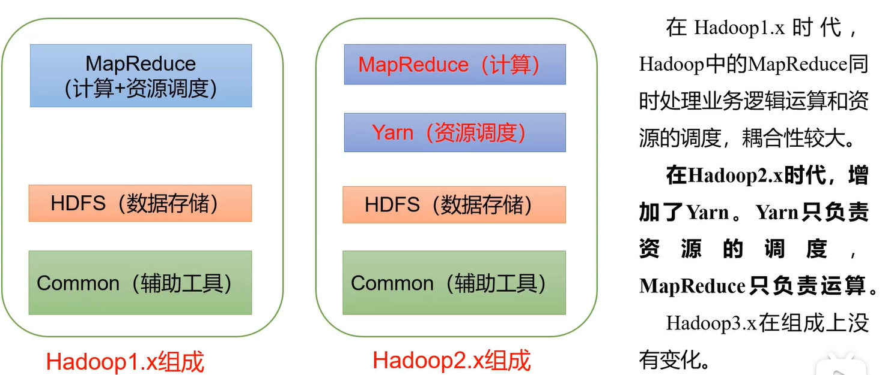

> 1.高可靠性:hadoop底层维护多个数据副本,所以即使hadoop某个计算元素或存储出现故障,也不会导致数据的丢失  
> 2.高扩展性,在集群间分配拟任务数据,可方便的扩展数以千计的节点  
> 3.高效性,在MapReduce的思想下,hadoop是并行工作的,以加快任务处理速度  
> 4.高容错性,能够主动将失败的任务重新分配

---

> 好的程序是要求高内聚,低偶合的,所以hadoop2.x版本是将MapReduce分卡了  
