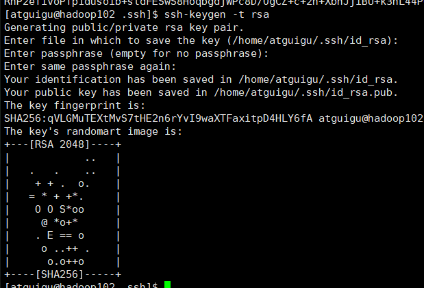

原理:  
  

> 在hadoop102中配置免密登录(按三次enter):  
> `ssh-keygen -t rsa`  
> 完成:  
>   
> 然后查看这个目录,有一个私钥(上面的),和公钥(第二个)  
>   
> 然后把私钥拷贝到hadoop103和hadoop104上:  
> `ssh-copy-id hadoop103`  
> then success:  
>   
> 