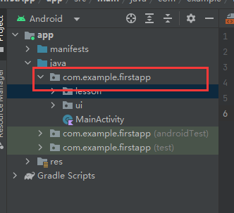
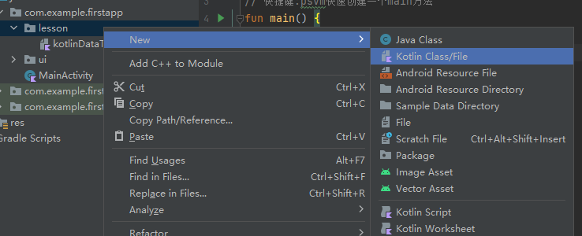

#### kotlin的跨平台特性

不仅像java一样支持javaJava虚拟机跨平台,也支持生成二进制代码跨平台

#### kotlin必知必会

- 为什么要优先使用kotlin进行android开发
- google宣布kotlin-first意味着什么
- 有哪些人都在使用kotlin
- kotlin十问
- kotlin必知必会的7打模块--本章课程体系介绍

#### kotlin是什么

kotlin是一门用于现代多平台应用的静态编程语言,其中被广泛用于android平台的开发,被称之为android世界的swift,它由jetbrains公司设计开发并开源,著名的ide工具idea就是他们的产品,所以无疑他们是对编程语言设计领域最为熟悉的专家

##### kotlin的优点

- 富有表现力且简介:
> 可以使用更少的代码实现更多的功能,少编写样板代码,在使用kotlin的专业开发者中,有67%的人反映其工作效率有所提高
- 更安全的代码:
> kotlin有许多语言功能,可帮助避免null指针异常等等常见编程错误,包含kotlin代码的android应用发生崩溃的可能性降低了20%
- 可交互操作:
> 可以在kotlin代码中调用java代码,或者在java代码中调用kotlin代码,kotlin可完全与java编程语言互操作,因此可以根据需要在项目中添加任意数量的kotlin代码
- 结构化并发:
> kotlin协程让异步代码像阻塞代码一样易用,协程可大幅简化后台任务管理,例如网络调用,本地数据访问等任务的管理

##### kotlin优先意味着什么

在构建新的android开发工具和内容(例如jetPack库,示例,文档和培训内容)时,google会在设计层面考虑到kotlin用户
| | java语言 | kotlin语言 |
|-|-|-|
|平台SDK支持|是|是|
|Lint|是|是|
|--引导式文档支持|是|是|
|API文档支持|是|是|
|androidX kotlin特有api(KTX,协程等)|无|是|
|示例|是|是|
|多平台项目|否|是|
|jetpack compose|否|是|

#### kotlin基本数据类型

- 基本数据类型
- 浮点类型
- 字符类型
- 字符串类型
- 类型强制转换
- 数字运算

> 基本数据类型

| 类型   | 位宽度 |
| :----- | :----: |
| Double |   64   |
| Float  |   32   |
| Long   |   64   |
| Int    |   32   |
| Short  |   16   |
| Byte   |   8    |

##### 快速开始写第一个kotlin程序:

在android studio中直接新建kotlin语言的空项目,

`project`选项卡中切换为`Android`tab栏:

我这里的项目名为`firstapp`



右键,新建一个package,这里我新建的package为lesson,lesson右键,新建kotlin文件:



###### 创建主函数

快捷键:`psvm`

```kotlin
package com.example.firstapp.lesson

// 快捷键:psvm快速创建一个main方法
fun main() {

}
```

###### 定义变量

```kotlin
package com.example.firstapp.lesson

// 快捷键:psvm快速创建一个main方法
fun main() {
    // 编辑器会根据赋值,自动推断num的数据类型为int
    // 如果超过了int的取值范围,则会自动推断为Long
    val num = 100;
    // 在变量的后面加上 : 加上 数据类型
    val bateNum: Byte = 1;
    val flotNum: Float = 3.141568421325F;
    val doubleNum: Double = 30.2561111132;
    // float数据类型,如果赋值超过了精度,会四舍五入,最多保留小数点后6位
    // double最多保留小数点后16位
    println(num)
    println("flotNum:")
    println(flotNum)
    println("doubleNum:")
    println(doubleNum)
}
```

##### 字符类型

```kotlin
// 赋值的时候用单引号引起来
    val char: Char = 'z';
```

##### boolean类型

```kotlin
// boolean类型
    val booleanConst: Boolean = true
    // 或者直接赋值
    val booleanConst2=false;
```

##### 字符串类型:

```kotlin
// 字符串类型
// 从0开始
    val str: String = "123456786"
    val strNum: Char = str[1];
    println("strNum")
    println(strNum)
```

##### 字符串模板

```kotlin
// 字符串模板
    println("-----------------");
    val number = 100;
// 字符串的模板表达式,以$开始
    println("the result is $number");
// 或者用${}括起来的表达式
    val testStr:String="this is a test string";
    println("testStr's length is ${testStr.length}")
// 字符串与转义字符串内部都支持模板,如果你需要在原始模板字符串中表示字面量$字符串(它不支持反斜杠转义),你可以用下列语法:
    val price="${'$'}9.9";
    println("price is $price");
// 和java一样,kotlin可以用 + 操作符连接字符串,这也适用于连接字符串与其他类型的值
    val age=28;
    println("i am "+ age +" years old!");
    println("i am $age years old!")
```

#### 字符串的值

###### \n 换行

```kotlin
// \n 换行
val s = "hello world!\n";
println(s)
```

run:

```shell
hello world!


Process finished with exit code 0
```

##### \反斜杠对""进行转义,保留字符串格式

```kotlin
val s2 = "{\"key\":\"calue\"}"
println(s2)
```

run:

```shell
{"key":"calue"}

Process finished with exit code 0
```

##### 使用 """ 包裹直接输出

```kotlin
    val text = """
        for (c in "foo")
        print(c)
    """;
    println(text)
```

run:

```shel

        for (c in "foo")
        print(c)
    

Process finished with exit code 0
```

#### 类型转换

```kotlin
// 声明一个整形
    val number100: Int = 109955620;
    println("转换为string${number100.toString()}")
```

run:

```shell
转换为string109955620


Process finished with exit code 0
```

#### 运算

```kotlin
    println("运算")
// 整数相除还是会得到整数
    println("3/2:${3 / 2}")
// double相除才会有小数点后面的
    println("3.0/2:${3.0 / 2}")
    println("3/2.0:${3 / 2.0}")
    println("相乘")
    println("3*2:${3 * 2}")
    println("3.0*2:${3.0 * 2}")
    println("3*2.0:${3 * 2.0}")

// 与操作
    println("与操作")
    val flag1: Boolean = true;
    val flag2: Boolean = false;
    println("flag1.and(flag2):${flag1.and(flag2)}")
    println("有一个为true即为true")
    println("flag1.or(flag2):${flag1.or(flag2)}")
// 按位操作符,得了,目前用不上,太麻烦了
```

- double相除才会有小数点后面的

run:

```shell
运算
3/2:1
3.0/2:1.5
3/2.0:1.5
相乘
3*2:6
3.0*2:6.0
3*2.0:6.0
与操作
flag1.and(flag2):false
有一个为true即为true
flag1.or(flag2):true

Process finished with exit code 0
```

#### kotlin数据容器

> 容器用于存放数据的载体.容器分为数组,集合

- kotlin数组
- kotlin集合

#### kotlin数组

数组是一种初始化是指定容器大小,不可以动态调整期大小的容器,元素按顺序存储在一串连续的内存段上

##### kotlin数组创建技巧

> 数组中元素可以使任意类型

```kotlin
    val array1 = arrayOf(1, 2, 3, 45, 6);
// 数组中元素可以使任意类型
    val array2 = arrayOf(1, true, "635")
    println(array1)
    println(array2)
```

> 创建一个指定大小,所有元素都为空的数组,但必须指定集合中的元素类型

```kotlin
// 创建一个指定大小,所有元素都为空的数组,但必须指定集合中的元素类型
    val array3:Array<String?> = arrayOfNulls<String>(5);
    array3[0]="你好";
    array3[1]="你bu好";
    array3[2]="fuck you!";
    array3[3]=null;
    println("array3:")
    println(array3)
```

> 用接收数组大小以及一个方法参数的Array构造方法,用作参数的方法能够返回给定索引的每个元素初始值:

```kotlin
// 用接收数组大小以及一个方法参数的Array构造方法,用作参数的方法能够返回给定索引的每个元素初始值:
    val asc = Array(5) { i -> (i * i).toString() }
    asc.forEach { println(it) }
```

run:

```shell
0
1
4
9
16
```

##### 原生类型数组

> Kotlin 也有无装箱开销的类来表示原生类型数组: `ByteArray`、 `ShortArray`、`IntArray` 等等。这些类与 `Array` 并没有继承关系，但是它们有同样的方法属性集。它们也都有相应的工厂方法

- 直接指定存入的数组:

```kotlin
val x: IntArray = intArrayOf(1, 2, 3)
    x[0] = x[1] + x[2]
    println("x[0]")
    println(x[0])
```

run:

```shell
x[0]
5

Process finished with exit code 0
```

```kotlin
	// 大小为 5、值为 [0, 0, 0, 0, 0] 的整型数组
	val arr = IntArray(5)
	println("arr")
	arr.forEach { println(it) }

	// 用常量初始化数组中的值的示例
	// 大小为 5、值为 [42, 42, 42, 42, 42] 的整型数组
	val arr2 = IntArray(5) { 42 }
	println("arr2")
	arr2.forEach { println(it) }
	

	// 使用 lambda 表达式初始化数组中的值的示例
	// 大小为 5、值为 [0, 1, 2, 3, 4] 的整型数组（值初始化为其索引值）
	var arr3 = IntArray(5) { it * 1 }
	println("arr3")
	arr3.forEach { println(it) }
```

run:

```shell
arr
0
0
0
0
0
arr2
42
42
42
42
42
arr3
0
1
2
3
4

Process finished with exit code 0
```

##### 遍历

```kotlin
var arr3 = IntArray(5) { it * 1 }
	arr3.forEach { println(it) }
	println("遍历:")
	for (item in arr3){
		println(item)
	}
```

run:

```shell
遍历:
0
1
2
3
4

Process finished with exit code 0
```

####### 下标遍历

```kotlin
println("下标遍历")
	val arr4: IntArray = intArrayOf(1, 2, 6541, 546, 1651, 1351)
	for (i in arr4.indices) {
		println(i.toString() + "->" + arr4[i])
	}
```

run:

```shell
下标遍历
0->1
1->2
2->6541
3->546
4->1651
5->1351

Process finished with exit code 0
```

####### 带索引与元素的遍历

```kotlin
println("带索引同时带元素的遍历:")
	for ((index, item) in arr4.withIndex()) {
		println("${index}->${item}")
	}
```

run:

```shell
带索引同时带元素的遍历:
0->1
1->2
2->6541
3->546
4->1651
5->1351

Process finished with exit code 0
```

####### forEach的增强版

```kotlin
val arr4: IntArray = intArrayOf(1, 2, 6541, 546, 1651, 1351)
print("froEach增强版")
	arr4.forEachIndexed { index, item ->
		println("index:${index}->item:${item}")
	}
```

run

```shell
froEach增强版index:0->item:1
index:1->item:2
index:2->item:6541
index:3->item:546
index:4->item:1651
index:5->item:1351

Process finished with exit code 0
```

#### 集合


>  集合概述

Kotlin 标准库提供了一整套用于管理_集合_的工具，集合是可变数量 （可能为零）的一组条目，各种集合对于解决问题都具有重要意义，并且经常用到。

集合是大多数编程语言的常见概念，因此如果熟悉像 Java 或者 Python 语言的集合，那么可以跳过这一介绍转到详细部分。

集合通常包含相同类型的一些（数目也可以为零）对象。集合中的对象称为_元素_或_条目_。例如，一个系的所有学生组成一个集合，可以用于计算他们的平均年龄。

以下是 Kotlin 相关的集合类型：

-   _List_ 是一个有序集合，可通过索引（反映元素位置的整数）访问元素。 元素可以在 list 中出现多次。列表的一个示例是电话号码：有一组数字、这些数字的顺序很重要并且数字可以重复。
-   _Set_ 是唯一元素的集合。它反映了集合（set）的数学抽象：一组无重复的对象。一般来说 set 中元素的顺序并不重要。例如，the numbers on lottery tickets form a set: they are unique, and their order is not important.
-   _Map_（或者_字典_）是一组键值对。键是唯一的，每个键都刚好映射到一个值。 值可以重复。map 对于存储对象之间的逻辑连接非常有用，例如，员工的 ID 与员工的位置。

Kotlin 让你可以独立于所存储对象的确切类型来操作集合。换句话说，将 `String` 添加到 `String` list 中的方式与添加 `Int` 或者用户自定义类的到相应 list 中的方式相同。 因此，Kotlin 标准库为创建、填充、管理任何类型的集合提供了泛型的（通用的，双关）接口、类与函数。

这些集合接口与相关函数位于 `kotlin.collections` 包中。我们来大致了解下其内容。

#####  集合类型

集合对于解决问题都具有重要意义,并且经常用到,与数组不同的是,可变集合的大小可以动态改变

kotlin下集合分为三类:

- List 是一个有序列表,可以通过索引(下标)访问元素,与数组不同的是可变集合的大小可以动态改变
- Set 是唯一元素的集合,一组无重复的对象,一般来说set中元素的顺序并不重要,无序集合
- Map (字典)是一组键值对,键是唯一的,每个键都刚好映射到一个值,值可以重复

##### 集合创建技巧

> 集合分为可变集合,显而易见,是指集合创建完成之后,可以对集合进行增删改查操作

> 不可变集合,是指集合创建完成之后,不能对集合进行增删改查操作,会报异常

##### 集合创建方式

###### 可变集合

- 必须指定元素类型

> ListOf

```kotlin
    println("使用 mutableListOf 创建")  
  
   // 这里也可以不传参,在后续操作中动态添加  
   val numbers = mutableListOf("one", "two", "three", "four")  
   numbers.add("five")   // 这是可以的  
	// 指定位置添加元素:  
   numbers.add(2, "二号位")
	println(numbers)  
	println("使用 arrayListOf 创建")  
	val num = arrayListOf<String>("demo", "array", "fuckkkkkkkkkkkkkkkkkkkk", "demoooooooooo")  
	println(num)
```

run:
```shell
创建可变集合
使用 mutableListOf 创建
[one, two, 二号位, three, four, five]

Process finished with exit code 0
```

注意:
- 更改可变集合不需要它是以 [`var`](https://book.kotlincn.net/text/basic-syntax.html#%E5%8F%98%E9%87%8F) 定义的变量：写操作修改同一个可变集合对象，因此引用不会改变。 但是，如果尝试对 `val` 集合重新赋值，你将收到编译错误

such as:
```kotlin
    val numbers = mutableListOf("one", "two", "three", "four")  
  
   //numbers = mutableListOf("six", "seven")      // 编译错误
```

> MapOf

创建一个MapOf
```kotlin
   val array = mutableMapOf(Pair("key", "一个value"));  
   println(array)
```
run:
```shell
{key=一个value}

Process finished with exit code 0
```

初始化时不传参:
```kotlin
val array3 = mutableMapOf<String, String>();;  
array3["0"] = "zero";  
array3["1"] = "one first";  
array3["2"] = "second";  
array3["3"] = "second";  
array3["3"] = "third";  
println("array3:")  
println(array3)
```
run:
```shell
array3:
{0=zero, 1=one first, 2=second, 3=third}

Process finished with exit code 0
```

注意
- 这里的`array3["3"]`覆盖了前一个的value
- 不同的key可以有不同的value


> SetOf
创建一个可变set:
```kotlin
val set1 = mutableSetOf<String>()  
   set1.add("132");  
// 下面这个添加不进去  
   set1.add("132");  
   set1.add("2");  
   set1.add("3");  
   set1.add("4");  
   println("set1")  
   println(set1)
```

run:
```shell
set1
[132, 2, 3, 4]


Process finished with exit code 0
```


使用arraySetOf 创建的set2:

```kotlin
val set2 = arraySetOf<String>("阜成门骚粉", "asasfsad", "safasfa", "地方大法师")  
println("使用arraySetOf 创建的set2:")
```
run:
```shell
使用arraySetOf 创建的set2:
{asasfsad, 地方大法师, safasfa, 阜成门骚粉}

Process finished with exit code 0
```


set的遍历:
```kotlin
    val set1 = mutableSetOf<String>()  
   set1.add("132");  
// 下面这个添加不进去  
   set1.add("132");  
   set1.add("2");  
   set1.add("3");  
   set1.add("3");  
   set1.add("4"); 
   for (item in set1) {  
      println(item)  
   }
```
run:
```shell
132
2
3
4

Process finished with exit code 0
```

注意:
- set中重复的元素是添加不进去的


###### 不可变集合

- 必须指定元素类型  
- 必须指定初始化数据元素

> ListOf


```kotlin
val numbers2 = listOf<String>("你好", "fuck you", "demo")  
println("numbers2;")  
println(numbers2)  
// 编译错误  
// numbers2.add("in")
```


> mapOf

创建不可变的Map集合
```kotlin
val array4 = mapOf<String, String>(Pair("nihao", "这个是个tag"))  
println("array4;")  
println(array4)
```

run:
```shell
array4;
{nihao=这个是个tag}

Process finished with exit code 0
```

当然,你也可以使用to来创建一个mapOf:
```kotlin
val numbersMap = mapOf("key1" to 1, "key2" to 2, "key3" to 3, "key4" to 1)  
println("numbersMap;")  
println(numbersMap)
```
run:
```shell
numbersMap;
{key1=1, key2=2, key3=3, key4=1}

Process finished with exit code 0
```
注意
- `to` 符号创建了一个短时存活的 `Pair` 对象,因此建议仅在性能不重要时才使用它,为避免过多的内存使用，请使用其他方法。例如，可以创建可写 Map 并使用写入操作填充它。 [`apply()`](https://book.kotlincn.net/text/scope-functions.html#apply) 函数可以帮助保持初始化流畅。
例如:
```kotlin
println("---使用apply来创建:")  
val numbersMap2 = mutableMapOf<String, String>().apply { this["one"] = "1"; this["two"] = "2" }  
println("numbersMap2:")  
println(numbersMap2)
```
run:
```shell
---使用apply来创建:
numbersMap2:
{one=1, two=2}

Process finished with exit code 0
```


> setOf

创建一个不可变的set:
```kotlin
val set3 = setOf<String>("不可变", "nosadsadsa", "sasadsdsa")  
println(set3)
```

run:
```shell
[不可变, nosadsadsa, sasadsdsa]

Process finished with exit code 0
```


##### 一些常用操作:

###### isEmpty
> 是否为空,返回一个boolean

```kotlin
    val arr1 = mutableListOf<String>("fuck", "attribute", "6", "null")  
// 是否为空,返回一个boolean  
   println("arr1.isEmpty()")  
   println(arr1.isEmpty())
```

run:
```shell
arr1.isEmpty()
false

Process finished with exit code 0
```

###### contains

> 判断是否包含某一个元素,返回boolean

```kotlin
val arr1 = mutableListOf<String>("fuck", "attribute", "6", "null")
println("arr1.contains(" + 6 + "):")  
println(arr1.contains("6"))
```

run:
```shell
arr1.contains(6):
true

Process finished with exit code 0
```

> indexOf,lastIndexOf

```kotlin
val arr1 = mutableListOf<String>("fuck", "attribute", "6", "null")
println("arr1.indexOf(\"6\"):${arr1.indexOf("6")}")  
println("arr1.lastIndexOf(\"6\"):${arr1.lastIndexOf("6")}")
```
run:
```shell
arr1.indexOf("6"):2
arr1.lastIndexOf("6"):2

Process finished with exit code 0
```

> iterator

```kotlin
val arr1 = mutableListOf<String>("fuck", "attribute", "6", "null")
println("通过迭代器迭代:")  
val iterator = arr1.iterator();  
iterator.forEach { it ->  
   println("it:${it}")  
}
```
run:
```shell
通过迭代器迭代:
it:fuck
it:attribute
it:6
it:null

Process finished with exit code 0
```

###### clear
> 清空元素
```kotlin
val arr1 = mutableListOf<String>("fuck", "attribute", "6", "null")
println("清空元素")  
arr1.clear();  
println("arr1.isEmpty():${arr1.isEmpty()}")
```
run:
```shell
清空元素
arr1.isEmpty():true

Process finished with exit code 0
```

> 注意

- 在集合中想要修改某个元素,可以这样写:`ar1[0]="0"`

###### add
> 在指定index插入指定元素:

```kotlin
val arr1 = mutableListOf<String>("fuck", "attribute", "6", "null")
arr1.clear();
arr1.add(0, "6")  
println("arr1使用add之后:")  
println(arr1)
```
run:
```shell
arr1使用add之后:
[6]

Process finished with exit code 0
```

###### removeAt
> 移除指定index的元素

```kotlin
val arr1 = mutableListOf<String>("fuck", "attribute", "6", "null")
println("使用removeAt移除指定元素")
arr1.removeAt(0)  
println("arr1.isEmpty():${arr1.isEmpty()}")
```
run:
```shell
使用removeAt移除指定元素
[fuck, attribute, 6, null]

Process finished with exit code 0
```

###### reverse
> 翻转

```kotlin
val arr1 = mutableListOf<String>("fuck", "attribute", "6", "null")
println("翻转")  
arr1.reverse()  
println(arr1)
```
run;
```shell
翻转
[null, 6, attribute, fuck]

Process finished with exit code 0
```


###### shuffle
> 随机排列元素

```kotlin
val arr2 = mutableListOf<String>("fuck", "attribute", "6", "null")  
println("随机排列元素")  
arr2.shuffle()  
println(arr2)
```

run:
```shell
随机排列元素
[fuck, null, attribute, 6]

Process finished with exit code 0
```

###### sort
> 排序

```kotlin
val arr3 = mutableListOf<Int>(5, 8, 46, 952, 1329, 54)  
arr3.sort()  
println(arr3)
```
run:
```shell
[5, 8, 46, 54, 952, 1329]

Process finished with exit code 0
```

#### kotlin的函数和lambda表达式

##### 函数

> Kotlin 函数使用 `fun` 关键字声明

```kotlin
fun double(x: Int): Int {  
   return 2 * x  
}  
println(double(8))
```
run;
```shell
16

Process finished with exit code 0
```
> 调用成员函数使用点表示法

```kotlin
// 方法  
class Function {  
   fun demo(x: Int): Int {  
      return x * 99  
   }  
}  
  
fun main() {  
   println("调用成员函数:")  
   val demo = com.example.firstapp.lesson.Function();  
   println(demo.demo(10))  
}
```
run:
```shell
调用成员函数:
990

Process finished with exit code 0
```

###### 参数

> 函数参数使用 Pascal 表示法定义——_name_: _type_。参数用逗号隔开， 每个参数必须有显式类型
```kotlin
fun powerOf(obj: String, someThing: String = "power"): String {  
   return "$obj need more $someThing"  
}  
  
println(powerOf("I"))
```
run:
```shell
I need more power

Process finished with exit code 0
```

###### 默认参数

函数参数可以有默认值，当省略相应的参数时使用默认值。这可以减少重载数量：

```kotlin
fun powerOf(obj: String, someThing: String = "power"): String {  
   return "$obj need more $someThing"  
}  
  
println(powerOf("I"))
```
run:
```shell
I need more power

Process finished with exit code 0
```

###### 普通类和静态类的方法
普通类调用其方法需要创建一个实例,通过实例调用它的方法
```kotlin
// 方法  
class Function {  
   fun demo(x: Int): Int {  
      return x * 99  
   }  
}  
  
fun main() {  
   println("调用成员函数:")  
   val demo = com.example.firstapp.lesson.Function();  
   println(demo.demo(10))  
}
```
静态类无需创建实例,可以直接调用它的方法:
使用`object`关键字来创建
```kotlin
// 下面这个是静态类:  
object st {  
   fun print(x: String): String {  
      return "$x i need more power!"   }  
}
  
fun main() {  
   println("静态方法:")  
   println(st.print("你好"))  
}
```
run:
```shell
静态方法:
你好 i need more power!

Process finished with exit code 0
```

> 覆盖方法总是使用与基类型方法的默认参数值。 当覆盖一个有默认参数值的方法时，必须从签名中省略默认参数值`

```kotlin
open class A {  
   open fun foo(i: Int = 10) {  
      println("这是A中的foo")  
   }  
}  
  
class B : A() {  
   override fun foo(i: Int) {  
      println("这是B中的foo 传来的参数: $i")  
   }  // 不能有默认值。  
}
fun main() {
    println("---覆盖方法")  
   val bDemo=B();  
// 不传参  
   bDemo.foo()  
// 传参  
   bDemo.foo(153)
}
```
run:
```shell
---覆盖方法
这是B中的foo 传来的参数: 10
这是B中的foo 传来的参数: 153

Process finished with exit code 0
```

###### 具名参数

> 如果一个默认参数在一个无默认值的参数之前，那么该默认值只能通过使用[具名参数](https://book.kotlincn.net/text/functions.html#%E5%85%B7%E5%90%8D%E5%8F%82%E6%95%B0)调用该函数来使用

```kotlin
println("---具名参数")  
fun foo(  
   bar: Int = 0,  
   baz: Int,  
) { /*……*/  
   println("bar:$bar,baz:$baz")  
}  
  
foo(baz = 1) // 使用默认值 bar = 0
```
run:
```shell
---具名参数
bar:0,baz:1

Process finished with exit code 0
```

> 如果在默认参数之后的最后一个参数是 [lambda 表达式](https://book.kotlincn.net/text/lambdas.html#lambda-%E8%A1%A8%E8%BE%BE%E5%BC%8F%E8%AF%AD%E6%B3%95)，那么它既可以作为具名参数在括号内传入，也可以在[括号外](https://book.kotlincn.net/text/lambdas.html#%E4%BC%A0%E9%80%92%E6%9C%AB%E5%B0%BE%E7%9A%84-lambda-%E8%A1%A8%E8%BE%BE%E5%BC%8F)传入

```kotlin
fun foo(  
   bar: Int = 0,  
   baz: Int = 1,  
   qux: () -> Unit,  
) {  
   println("bar:$bar,baz:$baz")  
   println("qux:")  
   qux()  
  
}  
  
foo(1) { println("hello") }     // 使用默认值 baz = 1foo(qux = { println("hello") }) // 使用两个默认值 bar = 0 与 baz = 1foo { println("hello") }        // 使用两个默认值 bar = 0 与 baz = 1
```

run:
```shell
bar:1,baz:1
qux:
hello
bar:0,baz:1
qux:
hello
bar:0,baz:1
qux:
hello

Process finished with exit code 0
```

注意;
- 如果参数类型是() 说明该参数是一个方法类型
- 方法参数的返回值使用 -> String
- 方法体的最后一行就是该方法的返回值

###### 可变数量的参数（varargs）

>函数的参数（通常是最后一个）可以用 `vararg` 修饰符标记

```kotlin
fun <T> asList(vararg ts: T): List<T> {  
   val result = ArrayList<T>()  
   for (t in ts) // ts is an Array  
      result.add(t)  
   return result  
}  
  
val arr = asList("你好", "大意了")  
println(arr)
```
run:
```shell
[你好, 大意了]

Process finished with exit code 0
```

#### 条件与循环


##### if

>  在 Kotlin 中，`if` 是一个表达式：它会返回一个值。 因此就不需要三元运算符（`条件 ? 然后 : 否则`），因为普通的 `if` 就能胜任这个角色。

```kotlin
val a = 2
	val b = 3

	//sampleStart
	var max = a
	if (a < b) max = b

	// With else
	if (a > b) {
		max = a
	} else {
		max = b
	}

	// 作为表达式
	max = if (a > b) a else b

	// You can also use `else if` in expressions:
	val maxLimit = 1
	val maxOrLimit = if (maxLimit > a) maxLimit else if (a > b) a else b

	//sampleEnd
	println("max is $max")
	println("maxOrLimit is $maxOrLimit")
```

run:

```shell
max is 3
maxOrLimit is 3

Process finished with exit code 0
```

> `if` 表达式的分支可以是代码块，这种情况最后的表达式作为该块的值：

```kotlin
val a = 2
	val b = 3
val max2 = if (a > b) {
		println("Choose a")
		a
	} else {
		println("Choose b")
		b
	}
	println("max2:$max2")
```

run:

```shell
Choose b
max2:3

Process finished with exit code 0
```

##### When 表达式

> `when` 将它的参数与所有的分支条件顺序比较，直到某个分支满足条件。

```kotlin
	val x:Int = 5;
	when (x) {
		1 -> print("x == 1")
		2 -> print("x == 2")
		else -> {
			print("x is neither 1 nor 2")
		}
	}
```

run:

```shell
x is neither 1 nor 2
Process finished with exit code 0
```

`when` 既可以作为表达式使用也可以作为语句使用。如果它被当做表达式， 第一个符合条件的分支的值就是整个表达式的值，如果当做语句使用， 则忽略个别分支的值。 类似于 `if`，每一个分支可以是一个代码块，它的值是块中最后的表达式的值。

如果其他分支都不满足条件将会求值 `else` 分支。 如果 `when` 作为一个*表达式*使用，那么必须有 `else` 分支， 除非编译器能够检测出所有的可能情况都已经覆盖了， 例如，对于 [枚举（`enum`）类](https://book.kotlincn.net/text/enum-classes.html)条目与[密封（`sealed`）类](https://book.kotlincn.net/text/sealed-classes.html)子类型］。

```kotlin
fun eval2(number: Number): String = when (number) {
		is Int -> "this is Int number"
		is Double -> "this is Double"
		is Float -> "this is Float"
		is Long -> "this is Long"
		is Byte -> "this is Byte"
		is Short -> "this is Short"
		else -> "invalid number"
	}
	println("eval2(5):")
	println(eval2(5))
```

run:

```shell
eval2(5):
this is Int number

Process finished with exit code 0
```

> when也可以接受动态传参:

```kotlin
fun getValue(): Any {
		return 100
	}

	fun eval3(): String {
		return when (val value = getValue()) {
			is Int -> "this is Int $value".apply(::println)
			is String -> "this is String $value".apply(::println)
			is Double -> "this is Double $value".apply(::println)
			is Float -> "this is Float $value".apply(::println)
			else -> "unknown type $value".apply(::println)
		}
	}
	eval3()
```

run:

```shell
this is Int 100

Process finished with exit code 0
```

#### 泛型

Kotlin 中的类可以有类型参数，与 Java 类似：

```kotlin
class Box<T>(t: T) {
    var value = t
}
```

创建这样类的实例只需提供类型参数即可：

```kotlin
val box: Box<Int> = Box<Int>(1)
```

但是如果类型参数可以推断出来，例如从构造函数的参数或者从其他途径， 就可以省略类型参数

##### 泛型接口

```kotlin
fun main() {
	val drinkApple = DrinkApple()
	drinkApple.drink("drink")

}

interface Drink<T> {
	fun drink(t: T)
}

class DrinkApple : Drink<String> {
	override fun drink(t: String) {
		println("drink:${t}")
	}
}
```

run:

```shell
drink:drink

Process finished with exit code 0
```

##### 泛型类

```kotlin
fun main() {
//	泛型类
	val blueColor = BlueColor("blue");
	blueColor.printColor()
}

// 抽象类
abstract class Color<T>(val t: T) {
	abstract fun printColor()
}

class BlueColor(val color: String) : Color<String>(color) {
	override fun printColor() {
		println("printColor:$color")
	}
}
```

run:

```shell
printColor:blue

Process finished with exit code 0
```

#### 泛型方法:

```kotlin
fun main() {
//	泛型方法
	fromJson("{}", String::class.java);
}

// 泛型方法
fun <T> fromJson(json: String, tClass: Class<T>): T? {
	val t: T? = tClass.newInstance();
	return t
}
```

##### 泛型约束

```kotlin
fun main() {
// 泛型约束
	fromJson2("{}", JSONObject::class.java)
}
// 泛型约束
// 所传递的类型T必须满足JSONObject的子类,或JSONObject类
fun <T : JSONObject> fromJson2(json: String, tClass: Class<T>): T? {
	val t: T? = tClass.newInstance();
	return t
}
```

##### out,限定泛型的上限

在 Kotlin 中，有一种方法向编译器解释这种情况。这称为*声明处型变*： 可以标注 `Source` 的*类型参数* `T` 来确保它仅从 `Source<T>` 成员中*返回*（生产），并从不被消费。 为此请使用 `out` 修饰符：

```kotlin
interface Source<out T> {
    fun nextT(): T
}

fun demo(strs: Source<String>) {
    val objects: Source<Any> = strs // 这个没问题，因为 T 是一个 out-参数
    // ……
}
```

> 在使用处使用out,声明泛型上限

```kotlin
open class Animale
class DogAnimal : Animale()

class CatAnimal : Animale()

class WhiteAnimal : Animale()
fun animalFuns() {

// kotlin无法进行集合的强制转换,如果要使用,那么可以加上out关键字进行强转
// val animalList: ArrayList<Animale> = ArrayList<DogAnimal>()

// 这里传入的类型就可以是Animale或Animale的子类
// 在使用处使用out,声明泛型上限
	val animalList: ArrayList<out Animale> = ArrayList<DogAnimal>()
//但是每次这么写会很麻烦

}
```

> 在定义处使用out关键字来声明,允许传入的泛型参数可以是T以及T的子类

```kotlin
open class Animale
class DogAnimal : Animale()

class CatAnimal : Animale()

class WhiteAnimal : Animale()
class ArrayList<out T> {
	val animalList: ArrayList<Animale> = ArrayList<DogAnimal>()
}
```


##### in,约束泛型参数的类型下限

> 在使用处约束

```kotlin
open class Animale
class DogAnimal : Animale()
fun animalFuns() {
	val animalList2: InArrayList<in DogAnimal> = InArrayList<Animale>()
}
```

> 在定义处使用in关键字来声明,允许传入的泛型参数可以是T以及T的父类

```kotlin
class InArrayList<in T> {
}
```


