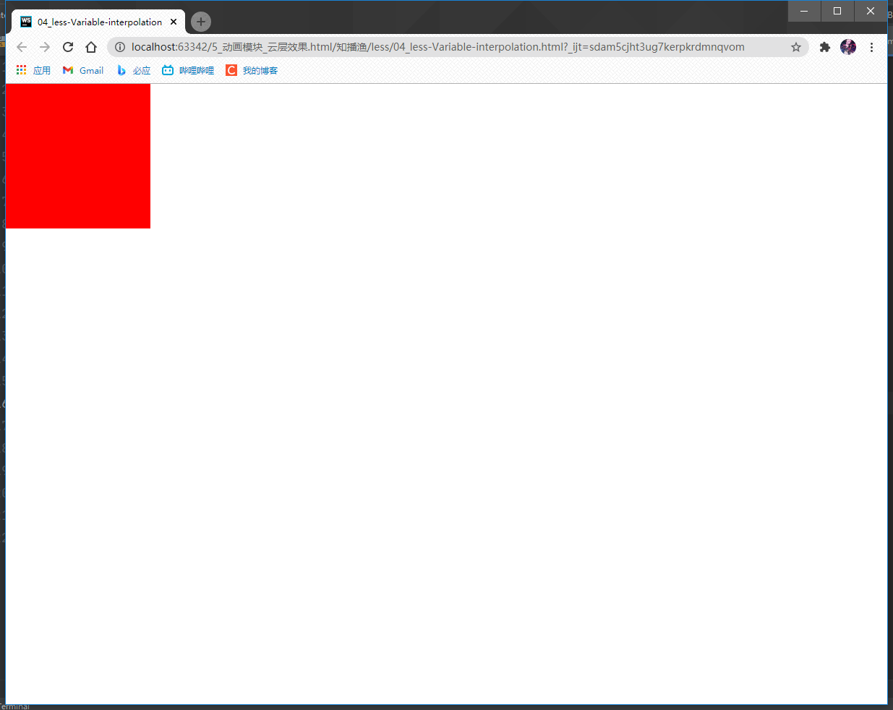

___之前直接上手了一些项目,接触到了less,用起来简单又方便(比CSS香多了),___<br>
___之后就想学习一下less,最近学了下,顺便也积累了写,就写个less的小结(此小结偏向于实践)___

---

* [less中文网](https://less.bootcss.com/) 

* less简介:Less 是一门 CSS 预处理语言,它扩展了 CSS 语言,增加了变量,Mixin,函数等特性,使 CSS 更易维护和扩展.Less 可以运行在 Node 或浏览器端

* 常见的css预处理器:Less,Sass,Stylus

---
* less编译为css:<br>

[考拉客户端](http://koala-app.com/index-zh.html)

[在线编译](https://www.w3cschool.cn/tools/index?name=LESS) 这种网站就很多了

(有时候运行less,想看看其编译的css样式的时候用得到)

---

* ### less在html中使用:<br>
直接引入,莫忘了在rel里面写 `stylesheet/less` <br>
link 直接 tab 不全的话,rel里是不会有后面的 /less ,此时是引入less会报错的(我用的webstrom是这样的)
```html
    <!--这两个是必须引入的-->
    <link rel="stylesheet/less" href="css/test.less">
    <script src="js/less.js"></script>
```

>补充:
>>h5的type属性中默认值就是type="text/css" ,所以在link标签中可以不写type(当然排除个别浏览器不支持,主流浏览器都支持)

---
* ### less的注释:
```less
// 单行注释
/*多行注释*/
```

---

* ### less中定义变量:<br>
和js中的基本概念一样

```less
    // 为w(宽)设置为300px
    @w: 300px;
    // 将w的值赋给h(高)
    @h: @w;
    // 为c(color的值)设置为red
    @c: red;
    .box1 {
      @c: blue;
      width: @w;
      height: @h;
      background: @c;
      margin-bottom: 20px;
      @c: pink;
    }
    .box2 {
      width: @w;
      height: @h;
      background: @c;
    }
```
HTML文件:
```html
<!DOCTYPE html>
<html lang="zh-CN">
<head>
    <meta charset="utf-8">
    <meta name="renderer" content="webkit">
    <meta http-equiv="X-UA-Compatible" content="IE=edge">
    <meta name="viewport" content="width=device-width, initial-scale=1">
    <title>03_less-variable</title>
    <style>
        * {
            margin: 0;
            padding: 0;
        }
    </style>
    <link rel="stylesheet/less" href="css/03_less-vairable.less">
    <script src="js/less.js"></script>
</head>
<body>
<div class="box1"></div>
<div class="box2"></div>

</body>
</html>
```
运行:


* less也有全局变量和局部变量之分:<br>
定义在{}外面就是全局变量,什么地方都可以使用<br>
定义在{}里面的就是局部变量,只能在{}中使用<br>

___注意点:less中的变量是延迟加载的,`写到后面变量也能在前面使用`___


* less中访问变量的原则与js一样:<br>
和js一样不同作用域的变量不会互相影响,只有相同作用域的变量才会互相影响<br>
和js一样在访问变量时会采用就近原则

* 在less中可以自定义变量名
```less
    @size: 200px;
    @w: width;
    @s: div;
    @{s} {
      /*在less中变量名如果想要用自定义的变量,那么必须使用变量差值的方法
      @{变量名}
      */
        @{w}: @size;
      height: @size;
      background: red;
    }
```
html代码:
```html
<!DOCTYPE html>
<html lang="zh-CN">
<head>
    <meta charset="utf-8">
    <meta name="renderer" content="webkit">
    <meta http-equiv="X-UA-Compatible" content="IE=edge">
    <meta name="viewport" content="width=device-width, initial-scale=1">
    <title>04_less-Variable-interpolation</title>
    <style>
        * {
            margin: 0;
            padding: 0;
        }
    </style>
    <link rel="stylesheet/less" href="css/04_less-Variable-interpolation.less">
    <script src="js/less.js"></script>
</head>
<body>
<div></div>

</body>
</html>
```
运行:
