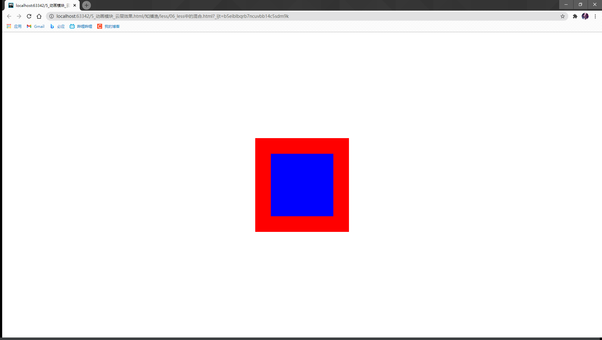

* less支持混合

>什么是less混合?

将需要重复使用的代码封装到一个类中,在需要的地方调用封装好的类即可,
在预处理的时候,less会自动将用到的封装好的类中的代码拷贝进来
本质就是ctrl+c --> Ctrl+v

- html代码:

```html
<!DOCTYPE html>
<html lang="zh-CN">
<head>
    <meta charset="utf-8">
    <meta name="renderer" content="webkit">
    <meta http-equiv="X-UA-Compatible" content="IE=edge">
    <meta name="viewport" content="width=device-width, initial-scale=1">
    <title></title>
    <style>
        * {
            margin: 0;
            padding: 0;
        }
    </style>
    <link rel="stylesheet" href="css/06.css">
</head>
<body>
<div class="father">
    <div class="son"></div>
</div>
</body>
</html>
```

例如,要利用上面的HTML代码实现这样一个效果:


#### 如果不用less混合的话,less代码:
```less
.father {
  width: 300px;
  height: 300px;
  background: red;
  position: absolute;
  left: 50%;
  top: 50%;
  transform: translate(-50%, -50%);

  .son {
    width: 200px;
    height: 200px;
    background: blue;
    position: absolute;
    left: 50%;
    top: 50%;
    transform: translate(-50%, -50%);
  }
}
```
而这其中有`后面四行代码是重复的`,

但是如果使用混合,将重复代码包装成一个类,用到这些代码的时候,在调用,岂不美哉@~@

#### less使用混合的代码:
````less
.center {
  position: absolute;
  left: 50%;
  top: 50%;
  transform: translate(-50%, -50%);
}

.father {
  width: 300px;
  height: 300px;
  background: red;
  .center();

  .son {
    width: 200px;
    height: 200px;
    background: blue;
    .center();
  }
}
````


* less中的混合的注意点:<br>
如果混合名称的后面没有(),那么在预处理的时候,会保留混合的代码<br>
如果混合的名称后面加上(),那么在预处理的时候,不会保留混合的代码<br>
预处理时,在less的center后面加上() 的话,<br>
转编译css文件的时候,就会将css中的center部分代码添加入css元素中,<br>

就比如:
center后面有`()`:
less:
```less
.center() {
  position: absolute;
  left: 50%;
  top: 50%;
  transform: translate(-50%, -50%);
}
.father {
  width: 300px;
  height: 300px;
  background: red;
  .center();
  .son {
    width: 200px;
    height: 200px;
    background: blue;
    .center();
  }
}
```
编译的css文件:
```css
.father {
  width: 300px;
  height: 300px;
  background: red;
  position: absolute;
  left: 50%;
  top: 50%;
  transform: translate(-50%, -50%);
}
.father .son {
  width: 200px;
  height: 200px;
  background: blue;
  position: absolute;
  left: 50%;
  top: 50%;
  transform: translate(-50%, -50%);
}
```

center后面没有`()`:<br>
less:
```less
.center {
  position: absolute;
  left: 50%;
  top: 50%;
  transform: translate(-50%, -50%);
}

.father {
  width: 300px;
  height: 300px;
  background: red;
  .center();

  .son {
    width: 200px;
    height: 200px;
    background: blue;
    .center();
  }
}

```
编译的css文件:
```css
.center {
  position: absolute;
  left: 50%;
  top: 50%;
  transform: translate(-50%, -50%);
}
.father {
  width: 300px;
  height: 300px;
  background: red;
  position: absolute;
  left: 50%;
  top: 50%;
  transform: translate(-50%, -50%);
}
.father .son {
  width: 200px;
  height: 200px;
  background: blue;
  position: absolute;
  left: 50%;
  top: 50%;
  transform: translate(-50%, -50%);
}
```
对比一下就看出来了


