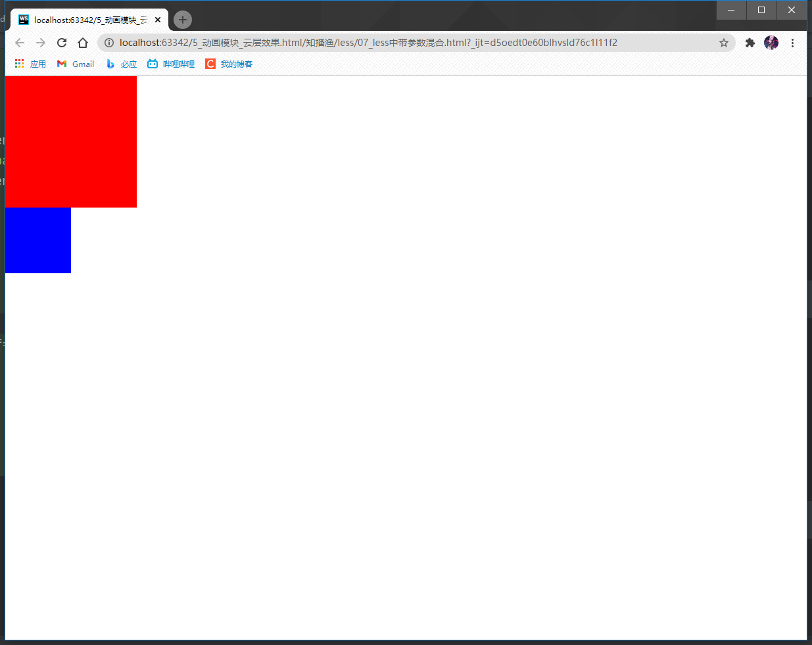

less中你可以定义一些形参,将数值传入形参,<br>
然后再将形参赋予给某一元素(就是利用形参为该元素添加属性)
如:
```less
// 创建一个形参
.whc(@w:,@h:,@c) {
  width: @w;
  height: @h;
  background: @c;
}
.div1 {
  //width: 200px;
  //height: 200px;
  //background: red;
　//下面一行就相当于上面三行的代码
  .whc(200px, 200px, red);
}
```
也可以使用`带默认参数混合`:
```less
.whc(@w:100px,@h:100px,@c:pink) {
  width: @w;
  height: @h;
  background: @c;
}

.div1 {
  .whc(200px, 200px, red);
}

.div2 {
  .whc(@c:blue);
}
```
用下面的html代码:
```html
<!DOCTYPE html>
<html lang="zh-CN">
<head>
    <meta charset="utf-8">
    <meta name="renderer" content="webkit">
    <meta http-equiv="X-UA-Compatible" content="IE=edge">
    <meta name="viewport" content="width=device-width, initial-scale=1">
    <title></title>
    <style>
        * {
            margin: 0;
            padding: 0;
        }
    </style>
    <link rel="stylesheet" href="css/07_less中带参数混合.css">
</head>
<body>
<div class="div1"></div>
<div class="div2"></div>

</body>
</html>
```
效果图:

