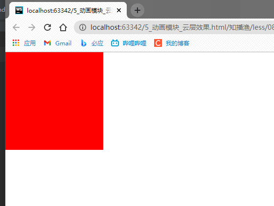
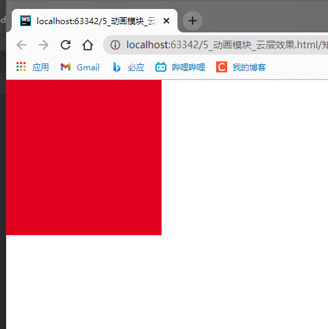
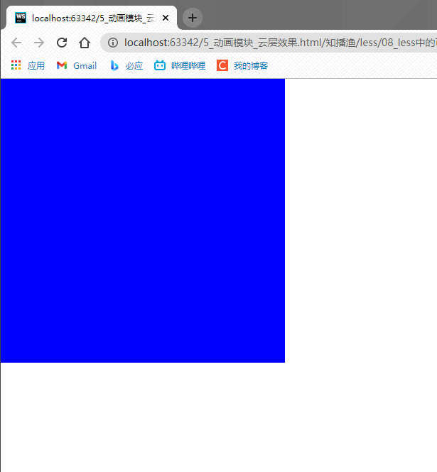

先上效果图(最开始是宽高200px,红色,鼠标移上去,变为宽高400px,蓝色,0s延迟,持续4s):




less如果不用可变参数的话:
```less
.animate(@name,@time,@mode,@delay) {
  transition: @name, @time, @mode, @delay;
}
div {
  width: 200px;
  height: 200px;
  background: red;
  .animate(all, 4s, linear, 0s);
}
```
在 () 写的东西有点多,四个参数,此时就可以`使用 ... 来接收参数`:<br>
其中 ... 表示可以接受0个或多个参数
```less
.animate(...) {
  // 也可以使用arguments来接收参数
  transition: @arguments;
}
```

translation至少接收两个参数,所以,用 ... 来实现:
```less
// 此时至少接收两个参数
.animate(@name,@time,...) {
  transition: @arguments;
}
```
* 注意:less中的arguments和js中的arguments一样,可以拿到传递进来的所有形参<br>
less中的 ... 表示使用了js中的 ... ,那么必须写在形参列表最后

所以,最终的less代码可以是:
```less
.animate(@name,@time,...) {
  transition: @arguments;
}

div {
  width: 200px;
  height: 200px;
  background: red;
  // 此时至少接收两个参数
  .animate(all, 4s);
}

div:hover {
  width: 400px;
  height: 400px;
  background: blue;
}
```
