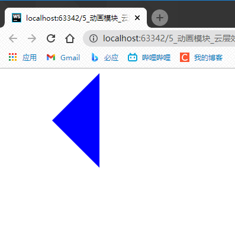
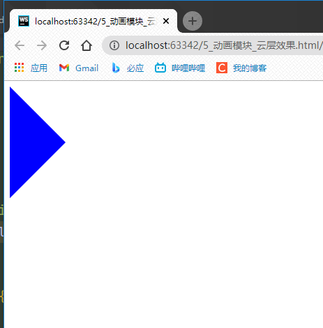

如果利用div创建一个箭头:



它的HTML代码:
```html
<!DOCTYPE html>
<html lang="zh-CN">
<head>
    <meta charset="utf-8">
    <meta name="renderer" content="webkit">
    <meta http-equiv="X-UA-Compatible" content="IE=edge">
    <meta name="viewport" content="width=device-width, initial-scale=1">
    <title></title>
    <link rel="stylesheet/less" href="css/09.less">
    <script src="js/less.js"></script>
</head>
<body>
<div></div>
</body>
</html>
```

它的less代码:
```less
.triangle(@width,@color) {
  width: 0;
  height: 0;
  border-style: solid solid solid solid;
}

div {
  .triangle(80px, blue);
}
```

如果要创建不同朝向的这个箭头,
此时可以利用less的匹配:
```less
.triangle(Down,@width,@color) {
  width: 0;
  height: 0;
  border-width: @width;
  border-style: solid solid solid solid;
  border-color: @color transparent transparent transparent;
}

.triangle(Top,@width,@color) {
  width: 0;
  height: 0;
  border-width: @width;
  border-style: solid solid solid solid;
  border-color: transparent transparent @color transparent;
}

.triangle(Left,@width,@color) {
  width: 0;
  height: 0;
  border-width: @width;
  border-style: solid solid solid solid;
  border-color: transparent @color transparent transparent;
}

.triangle(Right,@width,@color) {
  width: 0;
  height: 0;
  border-width: @width;
  border-style: solid solid solid solid;
  border-color: transparent transparent transparent @color;
}

div {
// 此时利用第一个形参,指定调用上面第四个 .triangle
  .triangle(Right, 80px, blue);
}
```

运行:



但是,此时可以发现,有好多`重复`的代码:
```less
  width: 0;
  height: 0;
  border-style: solid solid solid solid;
```
所以,此时可以用通用`匹配模式`:
```less
// 表示是要调用了这个 triangle ,就会执行里面的代码
.triangle(@_,@width,@color) {
  width: 0;
  height: 0;
  border-style: solid solid solid solid;
}
```
那么,less代码最终可以简化为:
```less
// @_ 表示匹配所有,只要调用了triangle,就会调用有 @_ 的样式
// @_ 表示通用的匹配模式
// 什么是通用匹配模式:
// 就是无论哪一个混合被匹配了,都会执行通用匹配模式中的代码
.triangle(@_,@width,@color) {
  width: 0;
  height: 0;
  border-style: solid solid solid solid;
}

.triangle(Down,@width,@color) {
  border-width: @width;
  border-color: @color transparent transparent transparent;
}

.triangle(Top,@width,@color) {
  border-width: @width;
  border-color: transparent transparent @color transparent;
}

.triangle(Left,@width,@color) {
  border-width: @width;
  border-color: transparent @color transparent transparent;
}

.triangle(Right,@width,@color) {
  border-width: @width;
  border-color: transparent transparent transparent @color;
}

div {
  .triangle(Left, 80px, blue);
}
```
让代码短了一丢丢