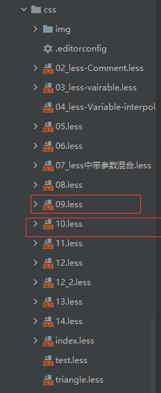

在less中引入(这玩意你可以引入文件名,加不加好慢的扩展名都可以,或者你直接引入要用的模块之类的):
```less
// 四种导入方式都可以
//@import "triangle.less";
//@import "triangle";
@import "09";
//@import "09.less";

div {
  .triangle(Down, 40px, red);
}
```
输出:


我这里的目录结构:



triangle这个东西在9.less中,<br>
代码:
```less
.triangle(@_,@width,@color) {
  width: 0;
  height: 0;
  border-style: solid solid solid solid;
}

.triangle(Down,@width,@color) {
  border-width: @width;
  border-color: @color transparent transparent transparent;
}
```


