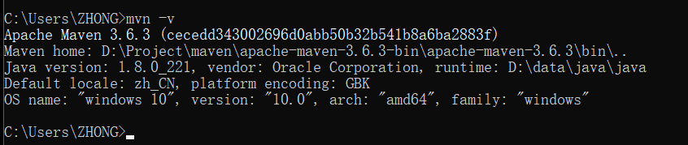
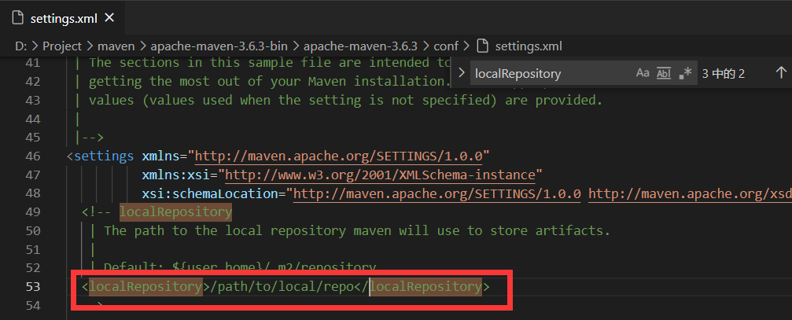
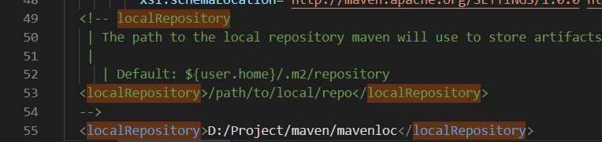
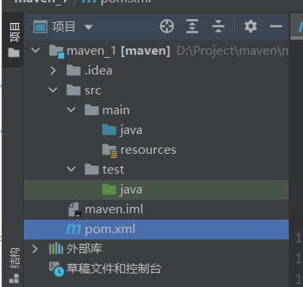

* 1.下载配置maven
>> [官网](http://maven.apache.org/download.cgi) ,[下载链接](https://mirror.bit.edu.cn/apache/maven/maven-3/3.6.3/binaries/apache-maven-3.6.3-bin.tar.gz)  
> > a.配置`JAVA_HOME` 
> b.配置`MAVEN_HOME` / `M2_HOME` 
> c.将maven中的bin配置到path: %MAVEN HOME%\bin 
> d.检验:命令行下输入`mvn -v`: 
>  
> e.配置本地仓库: 
> > 本地仓库需要在maven文件下的`conf`中的`seeting`中修改(默认值是:`${user.home}/.m2/repository`): 
> 修改本地仓库,把圈起来的东西抄出来就行了: 
> >  
> 修改后如图: 
>  
>

* 2.使用maven: 
>> 软件开发原则:约定 优于 配置 
> >> 1.硬编码方式: job.setPath("d:\abc"") 
>  2.配置方式:job 下写`conf.xml`<path>d:\abc</path> 
>  3.约定方式(使用默认值) 
> 
>> maven约定结果目录: 
>>> 执行项目去`main`中找,测试项目去`test`中找 
>  
> 其中`maven_1`为模块名, 
> `main`放主程序代码, 
> `test`放测试代码, 
> `resources`放资源代码/配置代码, 
> `pom.xml`:项目对象模型 

---

* maven的仓库: 
> 本地仓库: 
> 远程仓库: 
> > 中央仓库 
> 中央仓库镜像(对中央仓库的分流) 
> 私服nexus 
