* 编译命令:`mvn compile`

> 编译时,它会去编译HelloWorld中的java代码 
> 在编译时,需要在`pom`所在的目录(如"`C:\Windows\System32\cmd.exe`)进行命令行操作: 
> 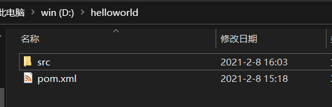 
> 使用`mvn compile`命令 
> 此时它会自动下载在`pom.xml`配置的本地仓库,添加的依赖时首先在本地仓库中找,本地仓库找不到了会去中央仓库下载 
> 完成时: 
> 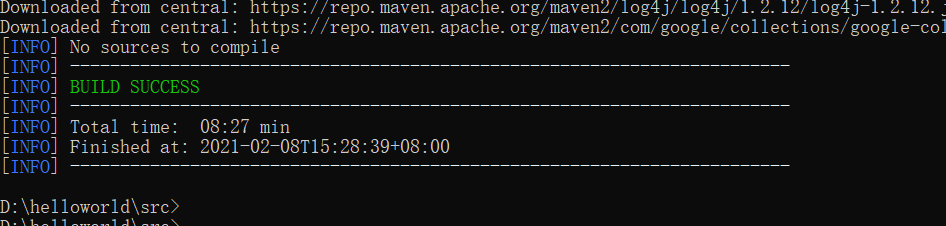 
> 在第一次下载时,它会下载一些基础的maven的jar包 
> 编译成功之后: 
> 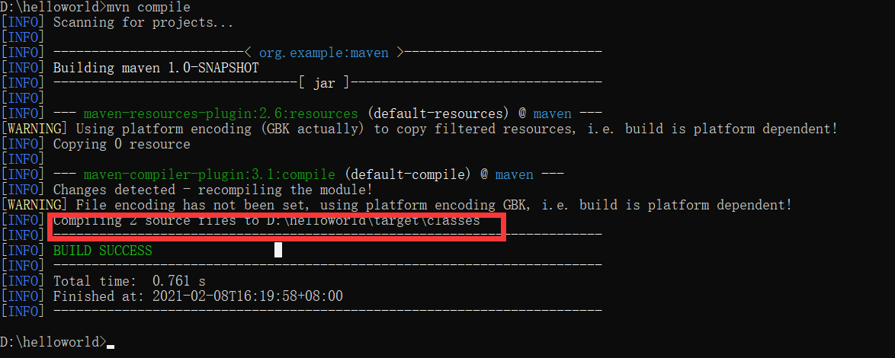 
> 圈起来的是编译之后代码的目录
> 该命令只编译main目录中的代码

* 测试命令:`mvn test`

> 还是在刚刚的命令行中操作 
> 使用`mvn test`命令: 
> 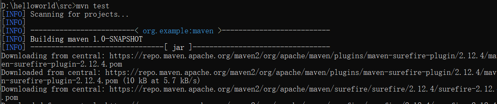  
> 此时它下载的是测试环境要用的一些基础包 
> 测试完之后,它会报告测试了多少,会报错 
> 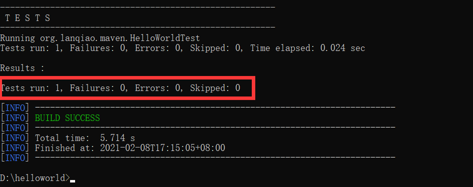

* 打包:`mvn package` 

> 第一次执行时也会下载一些环境 
> 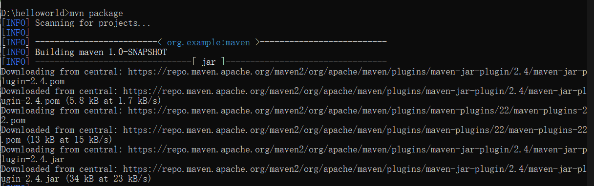 
> 注: *只有测试通过才能打包成功* 
> 打包成功: 
> 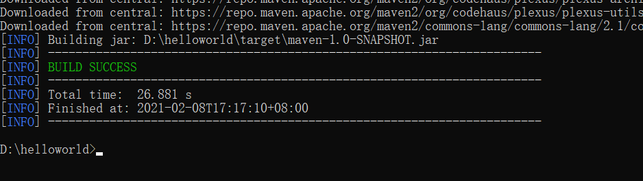 
> 同时会显示存放的路径

* 将所使用的插件放入本地仓库以供使用:`mvn install`

> 将开发的模块放入本地仓库供其他模块使用  
> 放入的路径由`pom.xml`中的`gav`决定
> 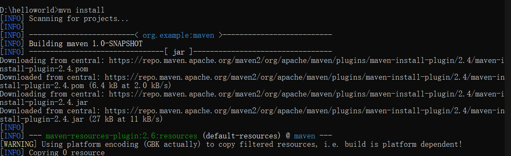  
> 完成:
> 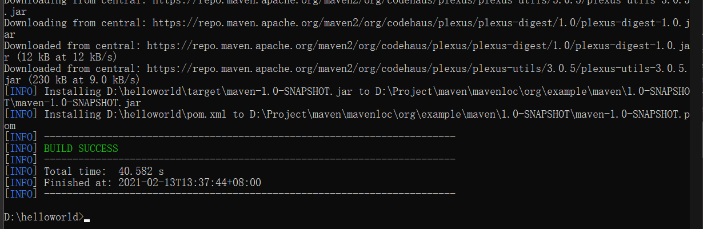  
> 这里安装到本地仓库的路径是在之前设置的路径: 
> 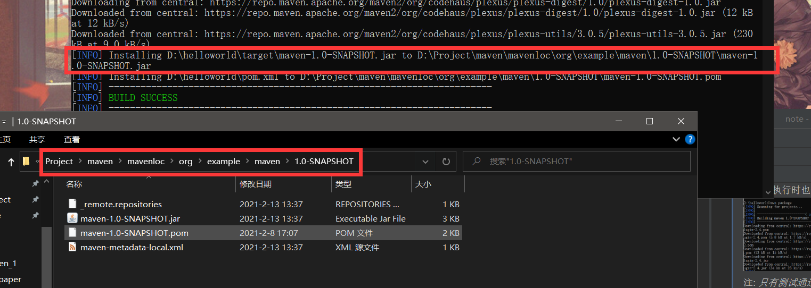
> 路径中和`pom.xml`中的`gav`对应关系: 
> 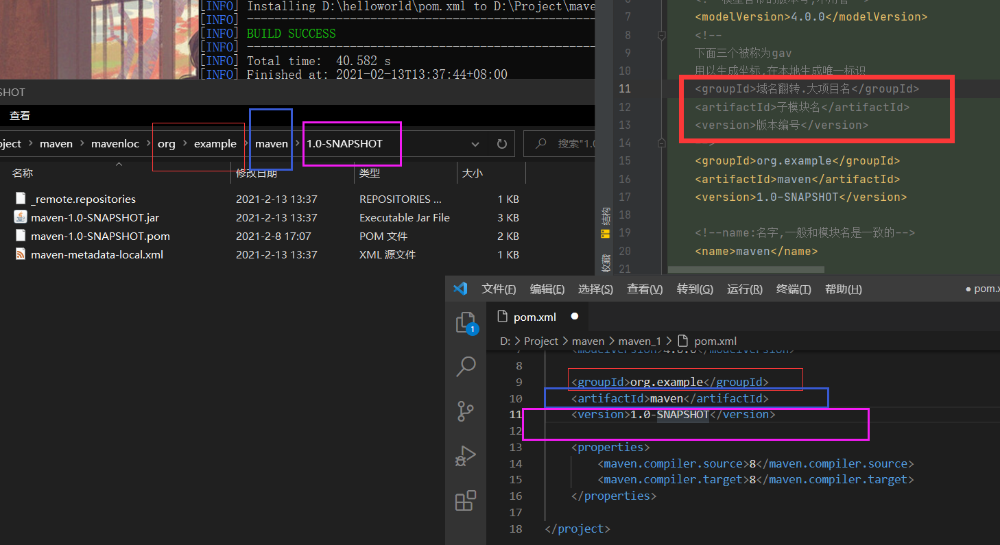

* 删除target(删除编译文件的目录):`mvn clean`
> 运行mvn命令,必须在pom.xml所在的目录

