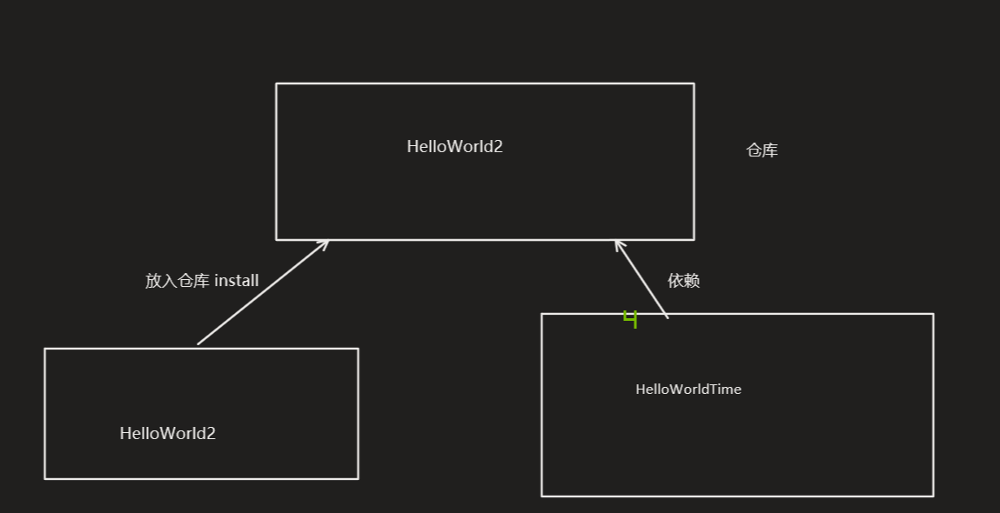
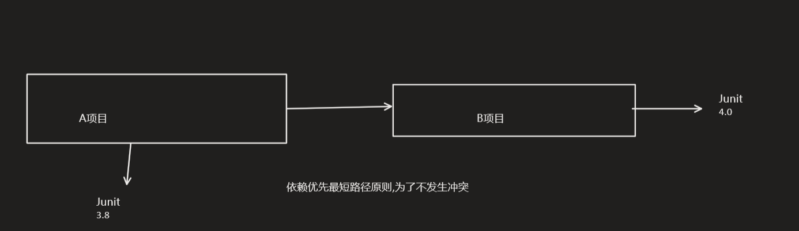

* 之前说过maven可以用于将项目整合起来<br/>

如图:`HelloWorldTime` 依赖于`HelloWorld2`<br/>


---

如果A项目依赖于B项目与`junit3.8`,同时B项目依赖于`junit4.0`,那么此时A项目会根据路径最短原则,<br/>
是为了防止冲突<br/>


路径长度相同时,<br/>
在同一pom文件中有两个不同版本的依赖,那么`后面声明的依赖会覆盖前面声明的依赖`,这种写法是严格禁止的 在同一个pom中,有两个相同的依赖,后面的声明会覆盖前面的声明 如果不在同一个pom文件有两个相同的依赖,则先声明的会覆盖后声明的


---

* 统一项目的jdk:
> build path : 删除旧版本,增加新版本

> 右键项目,属性,project Factors -java version 改版本(改之前存在要修改的版本)

>通过maven统一jdk版本:
> > ```xml
> > <profiles>
> >     <profile>
> >         <id>jdk17</id>
> >         <activation>
> >             <activeByDefault>true</activeByDefault>
> >             <jdk>1.7</jdk>
> >         </activation>
> >     </profile>
> > </profiles>
> > ```


