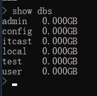
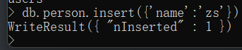

#### 关系型数据库和非关系型数据库

- 关系型数据库管理系统(RDBMS)
- 非关系型数据库(No SQL)

> MongoDB的数据模型是面向文档的,所谓文档是一种类似于JSON的结构,简单理解MongoDB这个数据库中存在的是各种各样的JSON(BSON)

数据库:

> - 数据库的服务器
>   - 服务器用来保存数据
>   - mongod用来启动
> - 数据库的客户端:
>   - 客户端来操作服务器,对数据进行增删改查的操作
>   - mongo用来启动客户端

---

#### 准备要注意的:

- `mongodb`安装之后要配置环境变量

- 在C盘根目录创建一个文件夹,叫做`data`,在`data`中创建一个文件夹叫:`db`
- 在`cmd`中输入`mongodb`,启动`mongodb`

---

### 最基础的命令:

> `mongod`

启动数据库(这一句是在cmd中执行mongod命令的前提)

> `mongo`

连接mongodb

> `show dbs`

和MYSQL中的 how databases; 指令一样,查看数据库

其中`admin`,`local`,`config`三个数据库是默认的

> use 新的数据库名称

创建数据库

> show collections

查看它的集合

> db.createCollection(‘创建集合的名称’)

创建一个集合

> db.集合名称.insert({json对象})

往集合中插入内容,它也是可以插入多个数据的

> db.集合名.find()

查找某一个集合

> db.集合名.drop()

删除一个集合

> db.dropDatabase()

删除所在的数据库

---

#### 改变默认的文件路径

需要在第一次启动时指定:

> `mongod --dbpath  指定路径`

- *注意这里的文件路径要有`\data\db`*

---

#### 改变默认的端口号:

> `mongod --dbpath  指定路径 --port 端口号`

---

#### 将mongod设置为系统自动启动:

1.在c盘根目录下创建`data`,`data`下要有`db`和`log`其中log文件夹为创建数据库文件夹之后创建的,用来存放日志

2.创建配置文件

​	C:\Program Files\MongoDB\Server\5.0 下添加一个配置文件: `mongod.cfg`

3.以管理员身份打开命令行窗口,

