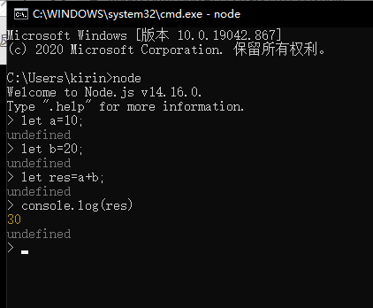
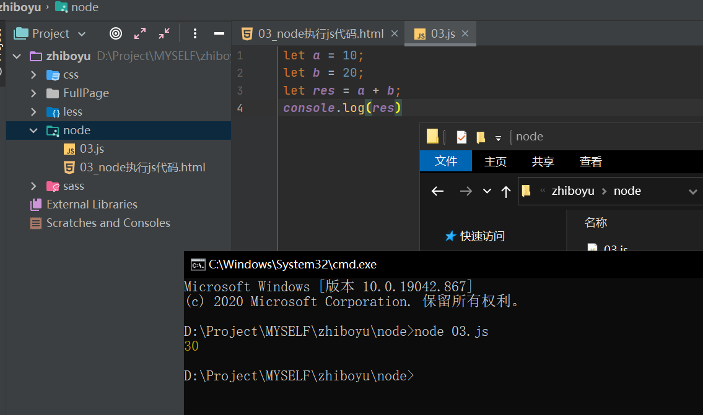

#### [Node概述](#overview)

#### [Node的执行方式](#Howitisexecuted)

#### [Node环境和浏览器环境的区别](#distinguish)

#### [Node身上全局对象的属性](#attribute)

#### [Node中的模块](#module)

#### [Node中导出数据的几种方式](#DataExport)

---  

<a id="overview"></a>

###### 1.什么是Node.js?

Node.js 是一个基于"Chrome V8 引擎" 的JavaScript "运行环境"

###### 2.什么是V8引擎?

V8引擎是一款专门解释和执行JS代码的虚拟机, 任何程序只要集成了V8引擎都可以执行JS代码 例如:
-将V8引擎嵌入到浏览器中，那么我们写的JavaScript代码就会被浏览器所执行； -将V8引擎嵌入到NodeJS中，那么我们写的JavaScript代码就会被NodeJS所执行。

###### 3.什么是运行环境?

运行环境 就是 生存环境 地球是人类的生存环境 浏览器是网页的生存环境 windows是.exe应用程序的生存环境 Android是.apk应用程序的生存环境 也就是说运行环境就是特定事物的生存环境 ... NodeJS也是一个生存的环境,
由于NodeJS中集成了V8引擎 所以NodeJS是JavaScript应用程序的一个生存环境

###### 4.总结:

NodeJS不是一门编程语言, NodeJS是一个运行环境, 由于这个运行环境集成了V8引擎, 所以在这个运行环境下可以运行我们编写的JS代码, 这个运行环境最大的特点就是提供了操作"操作系统底层的API",
通过这些底层API我们可以编写出网页中无法实现的功能(诸如: 打包工具, 网站服务器等)

---  
<a id="Howitisexecuted"></a>

##### Node的执行方式:

###### 1.由于浏览器中集成了V8引擎, 所以浏览器可以解释执行JS代码

1.1可以直接在浏览器控制台中执行JS代码  
1.2可以在浏览器中执行JS文件中的JS代码

如图:  


###### 2.由于NodeJS中也集成了V8引擎, 所以浏览器可以解释执行JS代码

2.1可以直接在命令行工具中编写执行JS代码(REPL -- Read Eval Print Loop:交互式解释器)  
2.2可以在命令行工具中执行JS文件中的JS代码

如图:  


---  

<a id="distinguish"></a>

#### Node环境和浏览器环境的区别:

##### 1.Node环境和浏览器环境区别

NodeJS环境和浏览器环境一样都是一个JS的运行环境, 都可以执行JS代码.  
但是由于宿主不同所以特点也有所不同

1.1内置对象不同

- 浏览器环境中提供了window全局对象
- NodeJS环境中的全局对象不叫window, 叫global

1.2this默认指向不同

- 浏览器环境中全局this默认指向window
- NodeJS环境中全局this默认指向空对象{}

1.3API不同

- 浏览器环境中提供了操作节点的DOM相关API和操作浏览器的BOM相关API
- NodeJS环境中没有HTML节点也没有浏览器, 所以NodeJS环境中没有DOM/BOM

---   

<a id="attribute"></a>

#### Node全局对象身上的属性:

##### 1.和浏览器一样Node环境中的全局对象也提供了很多方法属性供我们使用

中文文档地址: http://nodejs.cn/api/

__dirname: 当前文件所在文件夹的绝对路径  
__filename: 当前文件的绝对路径 setInterval / clearInterval : 和浏览器中window对象上的定时器一样 setTimeout / clearTimeout :  
和浏览器中window对象上的定时器一样 console :  和浏览器中window对象上的打印函数一样

---  

<a id="module"></a>

#### 什么是模块:

##### 1.什么是模块?

1.1浏览器开发中的模块 在浏览器开发中为了避免命名冲突, 方便维护等等 我们采用类或者立即执行函数的方式来封装JS代码, 来避免命名冲突和提升代码的维护性 其实这里的一个类或者一个立即执行函数就是浏览器开发中一个模块 let obj =
{ 模块中的业务逻辑代码 }; ;(function(){ 模块中的业务逻辑代码 window.xxx = xxx; })(); 存在的问题:
没有标准没有规范

1.2NodeJS开发中的模块 NodeJS采用CommonJS规范实现了模块系统

1.3CommonJS规范 CommonJS规范规定了如何定义一个模块, 如何暴露(导出)模块中的变量函数, 以及如何使用定义好的模块

- 在CommonJS规范中一个文件就是一个模块
- 在CommonJS规范中每个文件中的变量函数都是私有的，对其他文件不可见的
- 在CommonJS规范中每个文件中的变量函数必须通过exports暴露(导出)之后其它文件才可以使用
- 在CommonJS规范中想要使用其它文件暴露的变量函数必须通过require()导入模块才可以使用

如:

```javascript
//导出
let name = "it666.com";

function sum(a, b) {
    return a + b;
}

exports.str = name;
exports.fn = sum;
```

```javascript
//导入
let aModule = require('./06_a');
// console.log(name);
console.log(aModule);
console.log(aModule.str);
console.log(aModule.fn(10, 20))
```

---  
<a id="DataExport"></a>

##### Node中导出数据几种方式:

##### 1.在NodeJS中想要导出模块中的变量函数有三种方式

1.1通过exports.xxx = xxx导出  
1.2通过module.exports.xxx = xxx导出  
1.3通过global.xxx = xxx导出  
注意点:  
无论通过哪种方式导出, 使用时都需要先导入(require)才能使用  
通过global.xxx方式导出不符合CommonJS规范, 不推荐使用  

实例:  
`07_a.js`:
```javascript
let name = "it666.com";

function sum(a, b) {
    return a + b;
}

//导出数据的第一种方式
// exports.str = name;
// exports.fn = sum;

//第二种方式:
// module.exports.str = name;
// module.exports.fn = sum;

//第三种方式:
global.str = name;
global.fn = sum;
```
`07_b.js`:  
```javascript
//导入07_a.js
let aModule = require('./07_a');

//第一二种使用方式按照下面代码都可以执行
/*console.log(aModule);
console.log(aModule.str);

let res = aModule.fn(10, 20);
console.log(res);*/

//虽然没使用到aModule,但是如果没有导入,是无法使用str,fn的
//不符合commonjs的规范,知道就可
//第三种方式的接收代码:
console.log(str);
let res = fn(10, 20);
console.log(res);

```

---

##### exports和module.exports区别

exports只能通过 exports.xxx方式导出数据, 不能直接赋值  
module.exports既可以通过module.exports.xxx方式导出数据, 也可以直接赋值

注意点:  
在企业开发中无论哪种方式都不要直接赋值, 这个问题只会在面试中出现

---

#### require注意点:  
##### 1.require注意点
1.1require导入模块时可以不添加导入模块的类型  
如果没有指定导入模块的类型, 那么会依次查找.js .json .node文件  
无论是三种类型中的哪一种, 导入之后都会转换成JS对象返回给我们  

1.2导入自定义模块时必须指定路径  
require可以导入"自定义模块(文件模块)"、"系统模块(核心模块)"、"第三方模块"  
导入"自定义模块"模块时前面必须加上路径  
导入"系统模块"和"第三方模块"是不用添加路径  

1.3导入"系统模块"和"第三方模块"是不用添加路径的原因  
如果是"系统模块"直接到环境变量配置的路径中查找  
如果是"第三方模块"会按照module.paths数组中的路径依次查找  

---
#### 什么是包
###### 1.什么是包?  
前面说过在编写代码的时候尽量遵守单一原则,  
也就是一个函数尽量只做一件事情  
例如: 读取数据函数/写入数据函数/生成随机数函数等等,  
不要一个函数既读取数据又写入数据又生成随机数,  
这样代码非常容易出错, 也非常难以维护  
  
在模块化开发中也一样, 在一个模块(一个文件中)尽量只完成一个特定的功能  
但是有些比较复杂的功能可能需要由多个模块组成,  
例如: jQuery选择器相关的代码在A模块, CSS相关的代码在B模块, ...  
我们需要把这些模块组合在一起才是完成的jQuery  
那么这个时候我们就需要一个东西来维护多个模块之间的关系  
这个维护多个模块之间关系的东西就是"包"  
  
简而言之: 一个模块是一个单独的文件, 一个包中可以有一个或多个模块

###### 2.NodeJS包的管理
在NodeJS中为了方便开发人员发布、安装和管理包, NodeJS推出了一个包管理工具  
NPM(Node Package Manager)  
NPM不需要我们单独安装, 只要搭建好NodeJS环境就已经自动安装好了  
NPM就相当于电脑上的"QQ管家软件助手", 通过NPM我们可以快速找到我们需要的包,  
可以快速安装我们需要的包, 可以快速删除我们不想要的包等等  
npm config get prefix 查看 npm 安装路径(npm config set prefix 可设置 npm 安装路径)


---
#### NPM

##### 1.NPM包安装方式
- 全局安装 (一般用于安装全局使用的工具, 存储在全局node_modules中)
  npm install -g 包名 (默认安装最新版本)
  npm uninstall -g 包名
  npm update -g 包名 (更新失败可以直接使用install)

- 本地安装 (一般用于安装当前项目使用的包, 存储在当前项目node_modules中)
  npm install 包名
  npm uninstall 包名
  npm update 包名

##### 2.初始化本地包
npm init -> 初始化package.json文件  
npm init -y -> 初始化package.json文件

npm install 包名 --save  
npm install 包名 --save-dev

包描述文件 package.json, 定义了当前项目所需要的各种模块，以及项目的配置信息(比如名称、版本、许可证等元数据)。  
npm install 命令根据这个配置文件，自动下载所需的模块，也就是配置项目所需的运行和开发环境  
注意点:package.json文件中, 不能加入任何注释

- `dependencies`：生产环境包的依赖，一个关联数组，由包的名称和版本号组成
- `devDependencies`：开发环境包的依赖，一个关联数组，由包的名称和版本号组成

1.将项目拷贝给其它人, 或者发布的时候, 我们不会将`node_modules`也给别人, 因为太大,只需要给`package.json`就可以了  
2.因为有的包可能只在开发阶段需要, 但是在上线阶段不需要, 所以需要分开指定

使用`npm install`就是安装目录下package.json中的包

npm i 所有的包都会被安装  
`npm i --production` 只会安装dependencies中的包  
`npm i --development` 只会安装devDependencies中的包  

---
#### NRM和CNPM
##### 1.什么是nrm?
由于npm默认回去国外下载资源, 所以对于国内开发者来说下载会比较慢  
所以就有人写了一个nrm工具, 允许你将资源下载地址从国外切换到国内  

npm install -g nrm   安装NRM  
nrm --version 查看是否安装成功  
npm ls    查看允许切换的资源地址  
npm use taobao  将下载地址切换到淘宝  
nrm test  测试相应源的响应时间

PS:淘宝资源地址和国外的地址内容完全同步,。淘宝镜像与官方同步频率目前为 10分钟 一次以保证尽量与官方服务同步

##### 2.什么是cnpm?
由于npm默认回去国外下载资源, 所以对于国内开发者来说下载会比较慢  
cnpm 就是将下载源从国外切换到国内下载, 只不过是将所有的指令从npm变为cnpm而已

npm install cnpm -g –registry=https://registry.npm.taobao.org  安装CNPM  
cnpm -v  查看是否安装成功  
使用方式同npm, 例如: npm install jquery 变成cnpm install jquery 即可  

---
#### YARN使用

##### 1.什么是YARN?
Yarn是由Facebook、Google、Exponent 和 Tilde 联合推出了一个新的 JS 包管理工具  
Yarn 是为了弥补 npm5.0之前 的一些缺陷而出现的

注意点:  
在npm5.0之前，yarn的优势特别明显.但是现在NPM已经更新到6.9.x甚至7.x了,  
随着NPM的升级NPM优化甚至超越Yarn,所以个人还是建议使用NPM

##### 2.NPM的缺陷:
2.1npm install的时候巨慢  
npm 是按照队列执行每个 package，也就是说必须要等到当前 package 安装完成之后，才能继续后面的安装  
2.2同一个项目，npm install的时候无法保持一致性  
“5.0.3”表示安装指定的5.0.3版本，  
“~5.0.3”表示安装5.0.X中最新的版本，  
“^5.0.3”表示安装5.X.X中最新的版本  
2.3... ...

3.YARN优点:  
3.1速度快:  
- 并行安装: 而 Yarn 是同步执行所有任务，提高了性能  
- 离线模式：如果之前已经安装过一个软件包，用Yarn再次安装时之间从缓存中获取，就不用像npm那样再从网络下载了  
3.2安装版本统一：  
- 为了防止拉取到不同的版本，Yarn 有一个锁定文件 (lock file) 记录了被确切安装上的模块的版本号  
3.3... ...  

##### 4.YARN的安装
npm install -g yarn  
yarn --version

##### 5.YARN使用
5.1初始化包  
npm init -y  
yarn init -y

5.2安装包  
npm install xxx --save  
yarn add xxx  
npm install xxx --save-dev  
yarn add xxx --dev  

5.3移除包  
npm uninstall xxx  
yarn remove xxx  
  
5.4更新包  
npm update xxx  
yarn upgrade xxx --latest  

5.5全局安装  
npm install -g xxx  
npm uninstall -g xxx  
npm update -g xxx  

yarn global add xxx  
yarn global upgrade xxx  
yarn global remove xxx  


