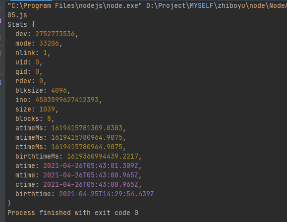

#### Buffer对象  

##### 0.准备知识  
0.1计算机只能识别0和1(因为计算机只认识通电和断电两种状态),  
0.2所有存储在计算机上的数据都是0和1组成的(数据越大0和1就越多)  
0.3计算机中的度量单位  
1 B(Byte字节) = 8 bit(位)  
// 00000000  就是一个字节  
// 111111111 也是一个字节  
// 10101010  也是一个字节  
// 任意8个 0或1的组合都是一个字节  
1 KB = 1024 B  
1 MB = 1024KB  
1 GB = 1024MB  
  
##### 1.什么是Buffer?  
Buffer是NodeJS全局对象上的一个类, 是一个专门用于存储字节数据的类  
NodeJS提供了操作计算机底层API, 而计算机底层只能识别0和1,  
所以就提供了一个专门用于存储字节数据的类  
  
##### 2.如何创建一个Buffer对象  
2.1创建一个指定大小的Buffer  
Buffer.alloc(size[, fill[, encoding]])  

2.2根据数组/字符串创建一个Buffer对象  
Buffer.from(string[, encoding])  
  
##### 3.Buffer对象本质  
本质就是一个数组  

---

##### Buffer的静态方法  

###### 1.检查是否支持某种编码格式
Buffer.isEncoding(encoding)

###### 2.检查是否是Buffer类型对象
Buffer.isBuffer(obj)

###### 3.获取Buffer实际字节长度
Buffer.byteLength(string[, encoding])
注意点: 一个汉字占用三个字节

###### 4.合并Buffer中的数据
Buffer.concat(list[, totalLength])

---

#### 文件操作:  

##### 查看文件状态:  
1.文件模块(fs)  
封装了各种文件相关的操作

2.查看文件状态  
fs.stat(path[, options], callback)  
fs.statSync(path[, options])

例如下面的代码:  
```javascript
let fs = require('fs');
//这个是一步方法,回调函数中,有错的话,err就有值,反之无值
/*
stats返回:
{
  dev: 2752773536,
  mode: 33206,
  nlink: 1,
  uid: 0,
  gid: 0,
  rdev: 0,
  blksize: 4096,
  ino: 4503599627412393,
  size: 217,
  blocks: 0,
  atimeMs: 1619361282252.1055,
  mtimeMs: 1619361282014.003,
  ctimeMs: 1619361282014.003,
  birthtimeMs: 1619360994439.2217,
  atime: 2021-04-25T14:34:42.252Z,
  mtime: 2021-04-25T14:34:42.014Z,
  ctime: 2021-04-25T14:34:42.014Z,
  birthtime: 2021-04-25T14:29:54.439Z
}

birthtime:文件创建时间
mtime:文件中内容发生变化的时间
* */

//下面这个是异步的
/*fs.stat(__filename, function (err, stats) {
    // console.log(stats);
    if (stats.isFile()) {
        console.log("当前路径对应的是一个文件");
    } else if (stats.isDirectory()) {
        console.log("当前路径对应的十一个文件夹");
    }
})*/


//同步的:
let stats = fs.statSync(__filename);
console.log(stats);
```  
返回:  


##### 文件读取:  
1.文件读取  
fs.readFile(path[, options], callback)  
fs.readFileSync(path[, options])

注意点:  
没有指定第二个参数, 默认会将读取到的数据放到Buffer中  
第二个参数指定为utf8, 返回的数据就是字符串


##### 写入文件:  
1.文件写入
fs.writeFile(file, data[, options], callback)  
fs.writeFileSync(file, data[, options])

##### 追加写入:  
1.追加写入  
fs.appendFile(path, data[, options], callback)  
fs.appendFileSync(path, data[, options])

#### 大文件操作:  
1.大文件操作  
前面讲解的关于文件写入和读取操作都是一次性将数据读入内存或者一次性写入到文件中  
但是如果数据比较大, 直接将所有数据都读到内存中会导致计算机内存爆炸,卡顿,死机等  
所以对于比较大的文件我们需要分批读取和写入  

fs.createReadStream(path[, options])  
fs.createWriteStream(path[, options])  

---

#### GET请求过来的参数处理:  
1.如何拿到Get请求传递过来的参数  
使用URL模块

url.format(urlObject)  将路径转换为对象  
url.parse(urlString[, parseQueryString[, slashesDenoteHost]])  将对象转换为路径

---

#### POST请求过来的参数处理:  

1.如何拿到POST请求传递过来的参数  
使用querystring模块

querystring.parse(str[, sep[, eq[, options]]])  将参数转换为对象  
querystring.stringify(obj[, sep[, eq[, options]]]) 将对象转换为参数

---

#### Node模块原理分析:  

##### 1.Node模块  
1.1在CommonJS规范中一个文件就是一个模块  
1.2在CommonJS规范中通过exports暴露数据  
1.3在CommonJS规范中通过require()导入模块

##### 2.Node模块原理分析  
既然一个文件就是一个模块,  
既然想要使用模块必须先通过require()导入模块  
所以可以推断出require()的作用其实就是读取文件  
所以要想了解Node是如何实现模块的, 必须先了解如何执行读取到的代码  

##### 3.执行从文件中读取代码  
我们都知道通过fs模块可以读取文件,  
但是读取到的数据要么是二进制, 要么是字符串  
无论是二进制还是字符串都无法直接执行  

但是我们知道如果是字符串, 在JS中是有办法让它执行的  
eval  或者 new Function;  

##### 4.通过eval执行代码  
缺点: 存在依赖关系, 字符串可以访问外界数据,不安全  
  
##### 5.通过new Function执行代码  
缺点: 存在依赖关系, 依然可以访问全局数据,不安全  
  
##### 6.通过NodeJS的vm虚拟机执行代码  
runInThisContext: 无权访问外部变量, 但是可以访问global  
runInNewContext:  无权访问外部变量, 也不能访问global  


