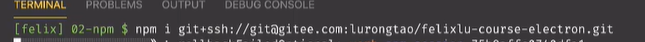

##### 1.什么是npm脚本:

npm允许在packagr.json文件里面,使用scripts字段定义脚本命令

```
{
    //...
    "scripts":{
    "build":"node build.js"
    }
}
```

##### 2.执行顺序:

如果npm脚本里面需要执行多个任务,那么需要明确它们的执行顺序:  
script1.js:

```javascript
var x = 0
console.log(x)
```

scripts2.js:

```javascript
var y = 0
console.log(y)
```

```
"scripts":{
    "script1":"node script1.js",
    "script2":"node script2.js"
}
```

---

可以在`package.json`中编写脚本顺序:   
如:

```json
{
  "name": "3.",
  "version": "1.0.0",
  "description": "",
  "main": "index.js",
  "scripts": {
    "test": "echo \"Error: no test specified\" && exit 1",
    "greeting": "echo hello",
    "runjs": "node ../../03scripts/script1.js & node ../../03scripts/script2.js"
  },
  "author": "",
  "license": "ISC",
  "dependencies": {
    "lodash": "^4.17.21"
  }
}
```

其中`scripts`下的`runjs`为运行script1.js和script2.js的脚本. 当其中的连接符号为`&`时,为并行运行,改为`&&`时为穿行运行.

##### 从g码云或者github安装包:

> npm i git+ssh://

example:


在项目中运行之后,会自动在package.json中添加配置

---

##### `cross-env`:

运行跨平台设置和使用环境变量的脚本

###### 出现原因:

当你使用 NODE_ENV=production 来设置环境变量的时候,大多数windows命令会提示阻塞(报错).(异常时windows上的Bash,它使用的是本机的Bash),换言之, windows不支持
NODE_ENV=production 的设置方式

###### 解决:

cross-env 使得你可以使用单个命令,而不必担心为平台正确设置或使用环境变量,这个迷你的包(cross-env)能够提供一个设置环境变量的 scripts .让你能够以unix的方式设置环境变量, 然后在windows上也能兼容运行

##### 安装:

> `npm i --save-dev cross-env`  


