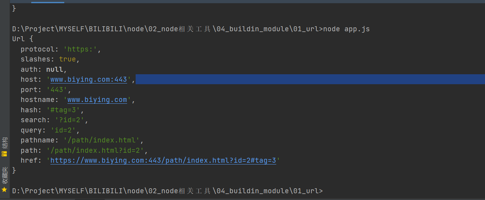

##### Node.Js有三类模块,即内置模块,第三方模块,自定义的模块  
1.1内置的模块  
Node.Js内置模块又叫核心模块,NodeJs安装完成可以直接使用,如:  
```javascript
const path=require('path')
var extname=path.extname('index.html')
console.log(extname)
```

1.2第三方的Node.Js模块  
第三方的Node.Js模块指的是为了实现某些功能,发布的npmjs.org上的模块,按照一定的开原协议供社群使用,如:  
> npm install chalk


#### 常用内置模块:  
#####1.url(用来分析地址/字符串的)  
##### 1.1parse  
url.parse(urlString[, parseQueryString[, slashesDenoteHost]])  
```javascript
const url = require('url')
const urlString = 'https://www.biying.com:443/ad/index.html?id=8&name=mouse#tag=110'
const parsedStr = url.parse(urlString)
console.log(parsedStr)
```
解析结果如图:  


##### 1.2 format
url.format(urlObject)
```javascript
const url = require('url')
const urlObject = {
  protocol: 'https:',
  slashes: true,
  auth: null,
  host: 'www.baidu.com:443',
  port: '443',
  hostname: 'www.baidu.com',
  hash: '#tag=110',
  search: '?id=8&name=mouse',
  query: { id: '8', name: 'mouse' },
  pathname: '/ad/index.html',
  path: '/ad/index.html?id=8&name=mouse',
  href: 'https://www.baidu.com:443/ad/index.html?id=8&name=mouse#tag=110'
}
const parsedObj = url.format(urlObject)
console.log(parsedObj)
```

##### 1.3resolve  
url.resolve(from, to)
```javascript
const url = require('url')
var a = url.resolve('/one/two/three', 'four')
var b = url.resolve('http://example.com/', '/one')
var c = url.resolve('http://example.com/one', '/two')
console.log(a + "," + b + "," + c)
```

---

#### 3.HTTP/HTTPS
##### 3.1 get
```javascript
var http = require('http')
var https = require('https')

// 1、接口 2、跨域
const server = http.createServer((request, response) => {
  var url = request.url.substr(1)

  var data = ''

  response.writeHeader(200, {
    'content-type': 'application/json;charset=utf-8',
    'Access-Control-Allow-Origin': '*'
  })

  https.get(`https://m.lagou.com/listmore.json${url}`, (res) => {

    res.on('data', (chunk) => {
      data += chunk
    })

    res.on('end', () => {
      response.end(JSON.stringify({
        ret: true,
        data
      }))
    })
  })

})

server.listen(8080, () => {
  console.log('localhost:8080')
})
```

##### 3.2 post：服务器提交（攻击）
```javascript
const https = require('https')
const querystring = require('querystring')

const postData = querystring.stringify({
  province: '上海',
  city: '上海',
  district: '宝山区',
  address: '同济支路199号智慧七立方3号楼2-4层',
  latitude: 43.0,
  longitude: 160.0,
  message: '求购一条小鱼',
  contact: '13666666',
  type: 'sell',
  time: 1571217561
})

const options = {
  protocol: 'https:',
  hostname: 'ik9hkddr.qcloud.la',
  method: 'POST',
  port: 443,
  path: '/index.php/trade/add_item',
  headers: {
    'Content-Type': 'application/x-www-form-urlencoded',
    'Content-Length': Buffer.byteLength(postData)
  }
}

function doPost() {
  let data

  let req = https.request(options, (res) => {
    res.on('data', chunk => data += chunk)
    res.on('end', () => {
      console.log(data)
    })
  })

  req.write(postData)
  req.end()
}

// setInterval(() => {
//   doPost()
// }, 1000)
```

##### 3.3 跨域：jsonp
```javascript
const http = require('http')
const url = require('url')

const app = http.createServer((req, res) => {
  let urlObj = url.parse(req.url, true)

  switch (urlObj.pathname) {
    case '/api/user':
      res.end(`${urlObj.query.cb}({"name": "gp145"})`)
      break
    default:
      res.end('404.')
      break
  }
})

app.listen(8080, () => {
  console.log('localhost:8080')
})
```

##### 3.4 跨域：CORS
```javascript
const http = require('http')
const url = require('url')
const querystring = require('querystring')

const app = http.createServer((req, res) => {
  let data = ''
  let urlObj = url.parse(req.url, true)

  res.writeHead(200, {
    'content-type': 'application/json;charset=utf-8',
    'Access-Control-Allow-Origin': '*'
  })

  req.on('data', (chunk) => {
    data += chunk
  })

  req.on('end', () => {
    responseResult(querystring.parse(data))
  })

  function responseResult(data) {
    switch (urlObj.pathname) {
      case '/api/login':
        res.end(JSON.stringify({
          message: data
        }))
        break
      default:
        res.end('404.')
        break
    }
  }
})

app.listen(8080, () => {
  console.log('localhost:8080')
})
```

##### 3.5 跨域：middleware（http-proxy-middware）  

```javascript
const http = require('http')
const proxy = require('http-proxy-middleware')

http.createServer((req, res) => {
  let url = req.url

  res.writeHead(200, {
    'Access-Control-Allow-Origin': '*'
  })

  if (/^\/api/.test(url)) {
    let apiProxy = proxy('/api', { 
      target: 'https://m.lagou.com',
      changeOrigin: true,
      pathRewrite: {
        '^/api': ''
      }
    })

    // http-proy-middleware 在Node.js中使用的方法
    apiProxy(req, res)
  } else {
    switch (url) {
      case '/index.html':
        res.end('index.html')
        break
      case '/search.html':
        res.end('search.html')
        break
      default:
        res.end('[404]page not found.')
    }
  }
}).listen(8080)
```

##### 3.6 爬虫
```javascript
const https = require('https')
const http = require('http')
const cheerio = require('cheerio')

http.createServer((request, response) => {
  response.writeHead(200, {
    'content-type': 'application/json;charset=utf-8'
  })

  const options = {
    protocol: 'https:',
    hostname: 'maoyan.com',
    port: 443,
    path: '/',
    method: 'GET'
  }

  const req = https.request(options, (res) => {
    let data = ''
    res.on('data', (chunk) => {
      data += chunk
    })

    res.on('end', () => {
      filterData(data)
    })
  })

  function filterData(data) {
    let $ = cheerio.load(data)
    let $movieList = $('.movie-item')
    let movies = []
    $movieList.each((index, value) => {
      movies.push({
        title: $(value).find('.movie-title').attr('title'),
        score: $(value).find('.movie-score i').text(),
      })
    })

    response.end(JSON.stringify(movies))
  }

  req.end()
}).listen(9000)
```


