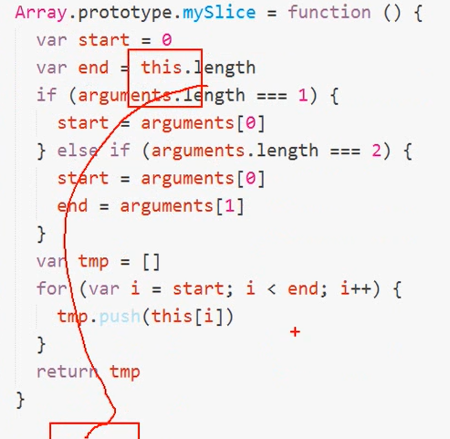
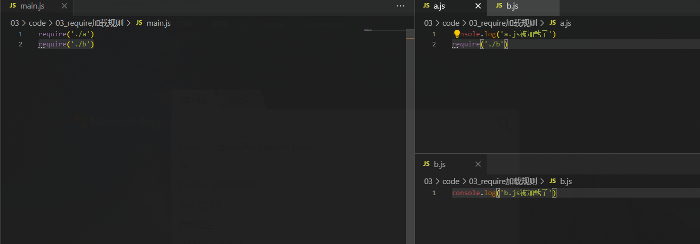

### node中的模块系统

使用node便携仪能用程序,主要就是在使用:  

- EcnnaScript语言
  - 和浏览器不一样,在node中没有DOM和BOM
- 核心模块
  - 文件 操作的fs
  - htpp服务的http
  - url路径的模块
  - path路径处理模块
  - os操作系统信息
- 第三方模块
  - art-template
  - 必须通过npm下载才可以使用
- 咱们自己写的模块
  - 自己创建的文件夹

---

### CommonJs模块化

> 什么是模块化?
>
> - 文件作用域
>
> - 通信规则
>   - 加载require
>   - 导出

> 在Nde中,javascript还有一个很重要的概念:模块系统
>
> - 模块作用域
> - 使用require方法用来加载模块
> - 使用exports接口对象用来导出模块中的成员

---

### 加载`require`

语法:

```javascript
var 自定义模块名称 = require('模块')
```

两个作用:

- 智行被加载模块中的代码
- 得到被加载模块中的`exports`导出接口对象

---


### 导出`exports`

- Node中是模块作用域,默认文件中所有的成员只在当前文件模块有效
- 对于希望可以被其他模块访问的成员,我们就需要把这些公开的成员都挂载到`export`接口对象中就可以导出多个成员了(必须在对象中):  

```javascript
exports.a=123
exports.b='hello'
exports.c=function(){
    console.log('ccc')
}
exports.b=function(){
    foo:'bar'
}
```

导出单个成员(拿到的就是:函数,字符串)

```javasc
module.exports='hello'
```

以下情况会覆盖:

```javascript
module.exports='hello'
modules.exports=function(x,y){
return x+y
}
```

也可以这样导出多个成员:

```javascript
modules.exports={
	add:function(x,y){
	return x+y
	},
	str:'hello'
}
```

---

### 原理解析:

`exports`和`module.exports`的一个引用

```javascript
console.log(exports===module.exports) // =>true
exports.foo='bar'
//等价于
module.exports.foo='bar'
```

给`exports`赋值会断开和`module.exports`之间的引用

同理,给`module.exports`赋值,也会断开

```javasc
module.exports='hello'
exports.foo='world'
```

真正去使用的时候:

导出多个成员: exports.xxx=xxx

注意:导出多个成员也可以:module.exports={}

多出单个成员: module.exports=

---

### jquery的each和原生的JavaScript方法foreach

- ecmascript提供的,
  - jquery2以上的不兼容IE8,2以下的兼容

- jquery的each由jquery这个第三方库提供
  - jquery2以下的版本兼容ie8
  - 它的each方法主要是用来遍历jquery实例对象(伪数组)
  - 同时它也可以作为低版本浏览器中的foreach替代品
  - jquery的实例对象不能使用foreach方法,如果想要使用必须转为数组才可以使用
  - `[].slice.call(jQuery实例对象)`
- 模块中导出多个成员和导出单个成员
- 



上图遍历转为数组

---


### 301和302的区别:

> 301是永久重定向,浏览器会记住
>
> 302是临时重定向,浏览器不会记住

---

### exports 和 module.exports 的区别(面试向)

  + 每个模块中都有一个 module 对象
  + module 对象中有一个 exports 对象
  + 我们可以把需要导出的成员都挂载到 module.exports 接口对象中
  + 也就是：`moudle.exports.xxx = xxx` 的方式
  + 但是每次都 `moudle.exports.xxx = xxx` 很麻烦，点儿的太多了
  + 所以 Node 为了你方便，同时在每一个模块中都提供了一个成员叫：`exports`
  + `exports === module.exports` 结果为  `true`s
  + 所以对于：`moudle.exports.xxx = xxx` 的方式 完全可以：`expots.xxx = xxx`
  + 当一个模块需要导出单个成员的时候，这个时候必须使用：`module.exports = xxx` 的方式
  + 不要使用 `exports = xxx` 不管用
  + 因为每个模块最终向外 `return` 的是 `module.exports`
  + 而 `exports` 只是 `module.exports` 的一个引用
  + 所以即便你为 `exports = xx` 重新赋值，也不会影响 `module.exports`
  + 但是有一种赋值方式比较特殊：`exports = module.exports` 这个用来重新建立引用关系的
  + 之所以让大家明白这个道理，是希望可以更灵活的去用它
- Node 是一个比肩 Java、PHP 的一个平台
  + JavaScript 既能写前端也能写服务端
  
  ```javascript
  moudle.exports = {
    a: 123
  }
  
  // 重新建立 exports 和 module.exports 之间的引用关系
  exports = module.exports
  
  exports.foo = 'bar'
  ```

```javascript
Array.prototype.mySlice = function () {
  var start = 0
  var end = this.length
  if (arguments.length === 1) {
    start = arguments[0]
  } else if (arguments.length === 2) {
    start = arguments[0]
    end = arguments[1]
  }
  var tmp = []
  for (var i = start; i < end; i++) {
    // fakeArr[0]
    // fakeArr[1]
    // fakeArr[2]
    tmp.push(this[i])
  }
  return tmp
}

var fakeArr = {
  0: 'abc',
  1: 'efg',
  2: 'haha',
  length: 3
}

// 所以你就得到了真正的数组。 
[].mySlice.call(fakeArr)
```

---

### require模块加载规则;

> 文件优先从缓存中加载
>
> 优点:
>
> ​	提高加载效率

如图,在下面的环境中,b只会引用一次:




> 第三方模块:
>
> 凡是第三方模块,必须通过 npm 来下载
>
> 使用的时候,就可以通过 require('包名') 的方式来加载才可以使用
>
> 不可能有任何一个第三方包和核心模块的名字一样
>
> 既不是核心模块也不是路径形式的模块,
>
> ​	先找到当前文件目录的 node_modules 目录,
>
> ​	然后找node_modules下的文件中的package.json文件,
>
> ​	在这个文件中找main属性
>
> ​	然后在main中找到该模块的入口文件
>
> ​	然后加载使用这个文件


> 如果package.json文件不存在或者main指定的入口模块是也没有
>
> ​	则node会自动找到该目录下的index.js
>
> ​	也就是说index.js会作为一个默认备选项
>
> 如果以上所有的任何一个条件都不成立,则会进入上一级目录中的node_modules目录查找,如果上一级还没有,则继续往上上一级查找
>
> 如果直到当前磁盘根目录还找不到,最后报错:
>
> ​	can't not find module

> 注意:我们一个项目有且只有一个node_modules,放在项目根目录中,这样的话,项目中所有子目录就不会出现多个node_modules
>
> 模块查找机制:
>
> ​	优先从缓存加载
>
> ​	核心模块
>
> ​	路径形式的文件模块
>
> ​	第三方模块
>
> ​		node_modules/art-template/
>
> ​		node_modules/art-template/package.json
>
> ​		node_modules/art-template/package.json main.js
>
> ​		index.js 备选项

---

### `--save`

写包的前面或者后面都行,

作用是该包安装在你项目的package.json中

最好是安装每个包都要加`--save`

---

### 文件操作路径和模块路径问题:

```javascript
var fs=require('fs')

// 咱们使用的所有文件操作的API都是异步的
// 就像你使用ajax请求一样
// 文件操作中的相对路径可以忽略 ./
// fs.readFile('data/a.txt',function(err,data){
//     if(err){
//         return console.log('失败');
//     }
//     console.log(data.toString());
// });

// 在模块加载中,相对路径中的 ./ 不能省略
// Error:Con't find module 'data/foo.js'
// require('data/foo.js')
// require('./data/foo.js')('hello')

// 此时文件前面没有加 . 那么,他就会去该文件的磁盘下开始找文件
fs.readFile('data/a.txt',function(err,data){
    if(err){
        return console.log('失败');
    }
    console.log(data.toString());
});
```

模块操作路径:

```javascript
// 如果忽略了 . ,则是磁盘根目录:
// require('/data/foo.js')
// 相对路径
// require('./data/foo.js')
```


