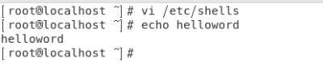
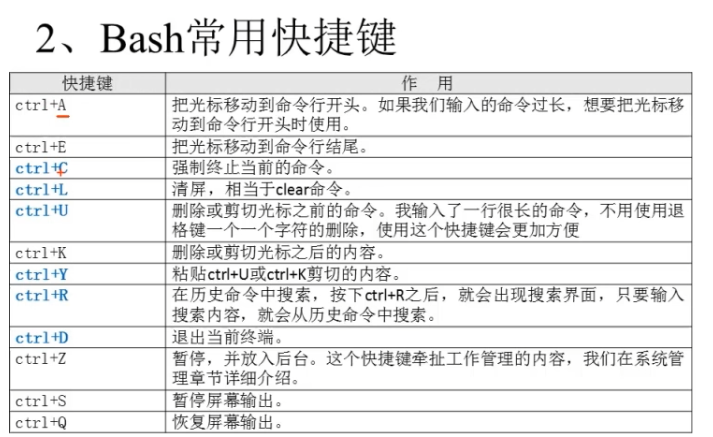

# 10-shell编程

10.1shell概述：

* what？

    * shell是一个命令行解释器，它为用户提供了一个向Linux内核发送请求以便运行程序的界面系统级程序，用户可以用shell来启动，挂起，停止甚至是编写一些程序。
    * shell还是一个功能强大的编程语言，易编写，灵活性较强。shell是解释器执行的脚本语言，在shell中可以直接调用Linux系统命令。

* shell分类：

    * Bourne Shell:从1979起Unix就开始使用。
    * Bourne Shell，Bourne Shell的主文件名为sh。
    * C Shell:C Shell主要在BSD版的Unix系统中使用，其语法和C语言类似而得名。
    * Shell的两种主要语法类型有：Bourne和C，这两种语法彼此不兼容。Bourne家族主要包括sh,ksh,Bash,psh,zsh;C家族主要包括：csh,tcsh。
    * Bash：Bash与sh兼容，现在使用的Linux就是使用Bash作为用户的基本Shell。

* Linux支持的shell：

    * /etc/shells

 

10.2shell脚本的执行方式

echo输出命令：

#echo [选项] [输出内容]

选项：

-e支持反斜线控制的字符转换

10.3Bash的基本功能

1.历史命令(每个用户的history位置都在自己的家目录下，查看历史命令时要在自己的家目录下,自己使用时最好不要清空历史命令，别人攻击时会清空历史命令，历史命令默认保存1000条)

选项：

-c:清空历史命令

-w;把缓存中的历史命令写入历史命令保存文件

~/.bash_history

* 历史命令默认保存1000条，可以再环境变量配置文件（/etc/profile）中修改,修改后必须要重新登陆一下才会生效。
* 历史命令的调用：

    * 使用上，下箭头调用以前的历史命令
    * 使用“!n”重复执行第n条命令
    * 使用“!!”重复执行上一条命令
    * 使用“！字串”重复执行最后一条以该字串开头的命令

* 命令与文件补全：

* 命令别名：
#alias别名=‘原命令’

#设定命令别名

#alias

#查询命令别名

让别名永久生效：（应修改自己的家目录下的文件）

#vi /root/.bashrc

#history [选项] [历史命令保存文件]

在Bash中，命令与文件补全是非常方便与常用的功能，我们只要输入命令或文件时，按Tab键就会主动进行补全，如果输入几个字母，有多个命令，则按两下Tab键就可以显示有哪些命令可以输入。

2.命令别名与常用快捷键

 

命令执行时顺序：

1第一顺位执行用绝对路径或相对路径执行的命令

2第二顺位执行别名

3第三顺位执行Bash的内部命令

4第四顺位执行按照$PATH环境变量定义的目录查找顺序找到第一个命令

 

 

输入重定向：（用处不多）

#wc [选项] [文件名]

选项:

-c统计字节数

-w统计单词数

-l统计行数

wc使用之后输入字符，Ctrl+d

输入几行几个单词几个字符

命令<文件把文件作为命令的输出

#wc <<字符

#aegv

#afe

#segfd

#字符(在输入相同字符时结束,并输出统计的几行,多少单词,多少字符)

 

多命令执行顺序

|多命令执行符|格式|作用|
|---|---|---|
|:|命令1:命令2|多个命令顺序执行,命令之间没有任何逻辑联系|
|&&|命令1&&命令2|逻辑与,当命令1正确执行,则命令2才会执行;当命令1执行不正确,命令2不会执行|
||||命令1||命令2|逻辑或,当命令1执行不正确,则命令2才会执行;当命令1执行正确,则命令2不会执行|

#dd if=输入文件of=输出文件bs=字节数count=个数

选项:

if=输入文件指源文件或源设备

of=输出文件指定目标文件或目标设备

bs=字节数指定一次输入/输出多少字节,即把这些字节看作一个数据块

count=个数指定输入/输出多少个数据块

InkNode is not supported/etc/shadow

下有些系统用户的shell为nologin，则为不可登录的意思

如果输出内容中有空格，则要加双引号

如果非要加！，则要将输出内容两边的双引号改为单引号

#echo -e "ab\bc"

#删除左侧字符

#echo -e "a\tb\tc\nd\te\tf"

#制表符（Tab键-）与换行符

#echo -e "[1;31m abcd\e[0m"

#输出红色的abcd字符

|#30m=黑色|31m=红色|32m=绿色|33m=黄色|
|---|---|---|---|
|34m=蓝色|35m=洋红|36m=青色|37m=白色|

 

 

错误输出与正确输出分开保存的方式作用不大，最常用的是将错误输出和正确输出同事保存在同一文件：

如下图：不管追加的正确与否，都可以追加

 

 
