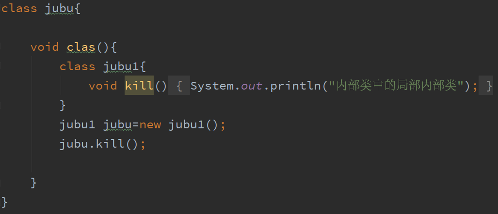
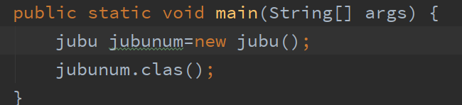

# 3.局部内部类

定义在方法中的内部类被称为局部内部类

1.不能使用一些修饰符public  private.......不能使用

2.局部内部类只能在定义的方法当中使用

3.局部内部类中不能包含静态变量(不能定义static类型的变量)

4.局部内部类中可以包含局部变量,使用局部变量的本质是final常量

当堆的对象没有人引用时，它并不是直接被销毁

在一个类里面创建一个class方法,在方法中创建一个jubu1的类,jubu1中创建一个clas方法

在调用clas时是需要创建一个jubu1的对象来调用的

