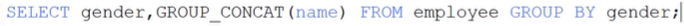
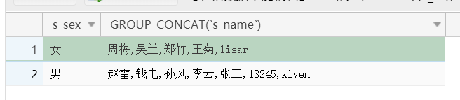

# DQL

查询表中所有内容:

SELECT * FROM 表名;

数据库执行DQL语句不会对数据进行改变,而是让数据库发送结果集给客户端

查询的结果返回的是一张虚拟的结果集

查询指定的列:

SELECT列名1,列表2,....FROM表名;

条件查询:

调价查询就是在查询时给出WHERE子句,在WHERE子句中可以只用一些运算符及关键字:

条件查询运算符及关键字:

=(等于),!=(不等于),<>(不等于),<(小于),>(大于),<=(小于等于),>=(大于等于);

BETWEEN……AND;值在什么范围之内

IN(set);固定的范围值

IS NULL;(为空) ISNOT NULL(不为空)

AND;与

OR;或

NOT;非

(如:

查询名字为san或者id为2的人

SELECT * FROM student WHERE stu_name='san' OR id=2;

查询学号为1001,1002或者1003的人:

SELECT * FROM student WHERE id=1001 OR id=1002 OR id=1003;

查询表中学生姓名为空的人:

SELECT *FROM student WHERE name IS NULL;

查询表中学生姓名不为空的人:

SELECT *FROM student WHERE name IS NOT NULL;

查询非男性的记录:

SELETE * FROM student WHERE gender !='男';

年龄在十八到二十的记录:

SELETE * FROM student WHEREage>=18 AND age<=20;

或:

SELETE * FROM student WHERE ageBETWEEN 18 AND 20;

)

模糊查询:

根据指定的关键字进行查询

使用LIKE关键字后跟通配符

通配符:

_:任意一个字符

%:任意0到n个字母

(如:

查询姓名为五个字母构成的学生记录(五个下划线):

SELECT * FROM studentWHERE name LIKE '_____';

在name表中查询姓名为五个字母构成的学生记录(五个下划线):

SELECT name FROM studentWHERE name LIKE '_____';

查询名字由五个字段构成,并且最后一个字段为s:

SELECT name FROM studentWHERE name LIKE '____s';

查询姓名以m开头的记录:

SELETE * FROM studentWHERE name LIKE 'm%';

查询第二个字母为u的记录:

SELETE * FROM studentWHERE name LIKE'_u%';

查询姓名中包含s的记录:

SELETE * FROM studentWHERE name LIKE'%s%';

)

 

* 求平均值:

    * SELECT AVG(`score`)  FROM `student` ;

* 求和:

    * SELECT SUM(`score`)  FROM `student` ;

* 求最大值:

    * SELECT MAX(`score`)  FROM `student` ;

* 求最小值:

    * SELECT MIN(`score`)  FROM `student` ;

 

 

* 聚合函数:

    * COUNT():统计指定列不是null的记录行数:
    * 统计所有不为null的有多少条

        * SELECT COUNT(*)  FROM `student`;

    * MAX():计算指定列的最大值,如果指定列是字符串类型,那么使用字符串排序运算
    * MIN():计算指定列的最小值,如果指定列是字符串类型,那么使用字符串排序运算
    * SUM():计算指定类的数值和,如果指定列类型不是数值型,那么计算结果为0
    * AVG():计算指定列的平均值,如果指定列类型不是数值类型,那么计算结果为0

字符控制查询:

查看表中名字:

SELETE name FROM student;

去除重复记录:

SELETEDISTINCTname FROM student;

把查询的结果进行运算,必须都是数据型:

SELETE  *, age+scoreFROM student;

列有很多记录的值为null,所以结算结果可能会出现null,下面使用了把null转换成数值的函数IFNULL:

这里为他们的和起了个别名sum3,as为关键字,而且as可以省略

SELETE*,IFNULL(age,0)+ IFNULL(score,0)as sum3FROM student;

对查询结果起别名:

SELETE  *,IFNULL(age,0)+ IFNULL(score,0)  AStotalFROM student;

SELECT  name AS resname FROM student;

对查询的结果进行排序操作使用关键字(ORDER BY):

升序(ASC,从小到打,默认,后面的desc可以不写):

SELECT * FROM studentORDER BY salary desc;

降序(DESC,从大到小);

SELECT * FROM studentORDER BY salary DESC;

如果排序的有意向相同,可以再次指定一项进行排序如果有salary相同的,按照id倒序优先:

SELECT * FROM studentORDER BY salary desc,idDESC;

SQL分组查询:

SELECT gender, GROUP_CONCAT('name') FROM employee GROUP BY gender;

根据gender查询分的组中有哪些人

分组使用:

SELECT genderFROM employee GROUP BY gender;

根据gender字段来分组,gender字段的全部值只有两个(男,女),所以分为了两组

当GROUP BY单独使用时,只显示出每组的第一条记录,

所以GROUP BY单独使用的意义不大

分组注意:在使用分组时,SELECT后面直接跟的字段一般都出现在GROUP BY后

group by +grou_concat():

1.group by +grou_concat(字段名)可以作为一个输出字段来使用

2.表示分组之后,根据分组结果,使用group by +grou_concat()来放置每一组的某字段的值的集合如:

3.SELECT gender,GROUP_CONCAT(name)from employee GROUP BY gender;

group by +聚合函数:

1.查询每个部门的名称及每个部门的人数:

* SELECT `s_sex` , GROUP_CONCAT(`s_name`) FROM `student` GROUP BY `s_sex`;

2.查询每个部门的部门名称以及每个部门工资大于1500的人数:SELECT department ,GROUP_CONCAT(salary),COUNT(*) FROM employee WHERE salary > 1500 GROU BY department;

 

groupby + having:

1.用来分组后指定一些条件来输出结果

2.having作用和where一样,但having只能用于groupby

查询每个部门的工资总和:SELECT department, GROUP_CONCAT(salary), SUM(salary) FROM employrr GROUP BY department;

3.查询工资总和大于9000的部门名称: SELECT department .GROUP_CONCAT(salary),SUM(salary) FROM employee GROUP BY department HAVING SUM(salary) >=9000;

4.having与where的区别:

having是在分组后进行过滤的

where是在分组前对数据进行过滤

having后面可以使用分组函数(统计函数)

where后面不可以使用分组函数

WHERE是对分组前记录的条件,如果某行记录没有满足WHERE子句的条件,那么这行记录不会参加分组,而HAVING是对分组后数据的约束

5.查询工资大于2000,工资总和大于6000的部门名称以及工资和

SELECT salary FROM employee WHERE salary >2000;(薪资大于两千)

SELECTdepartment, GROUP_CONCAT(salary)FROM employee WHERE salary >2000GROUP BY department HAVING SUM(salary) > 9000;

各部门工资总和大于6000,降序:SELECT department, SUM(salary) FROM employee WHERE salary > 2000GROUP BY department HAVING SUM(salary) >6000 ORDER BY SUM(salary) DESC;

 

书写顺序:

select >from >where >group by >having >order by >limit

limit:

从第n行开始显示m行数据:SELECT * FROM employee LIMIT n,m;

Limit参数1 ,参数2(参数1:从哪一行开始查;参数2:一共要查几行)

角标是从0开始

格式:select * from表名limit 0,5;

分页思路:

intcurpage = 1;当前页

int pageSize =3;每页多少数据

SELECT * FROM employeeLIMIT (curPage-1)*pageSize

