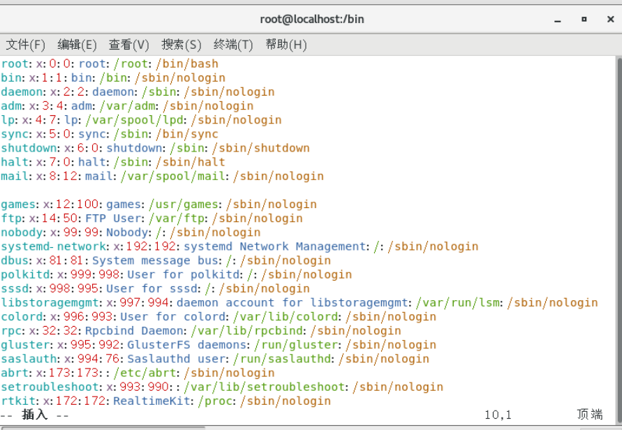

# GID,UID,初始组

第四字段:GID(用户初始组ID)

第五字段:用户说明

第六字段:家目录

普通用户:/home/用户名/

超级用户:/root/

第七字段:登录之后的shell(命令解释器)

/etc/passwd

第一字段:用户名称

第二字段:密码标志

第三字段:UID(用户ID)

0:超级用户

1-499:系统用户(伪用户,不可以登录,不可使用)

500-65535:普通用户

初始组:指用户一登录就立刻拥有这个用户组的相关权限,每个用户的初始组只能有一个,一般就是和这个用户的用户名相同的组名作为这个用户的初始组

附加组:指用户可以加入多个其他的用户的组,并拥有这些组的权限,附加组可以有多个

