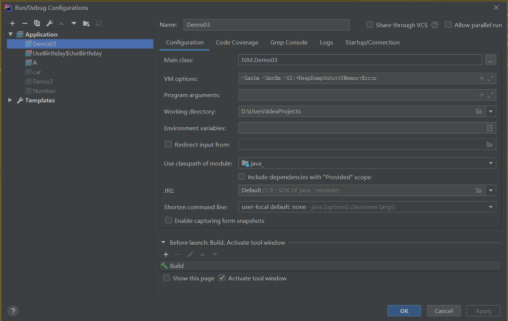
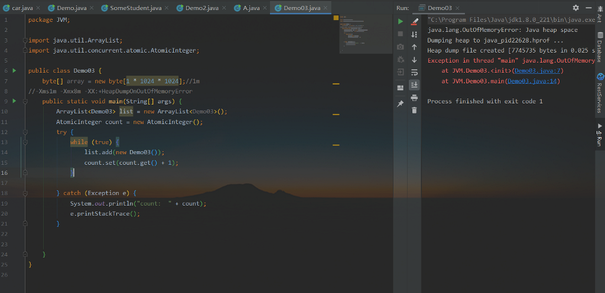
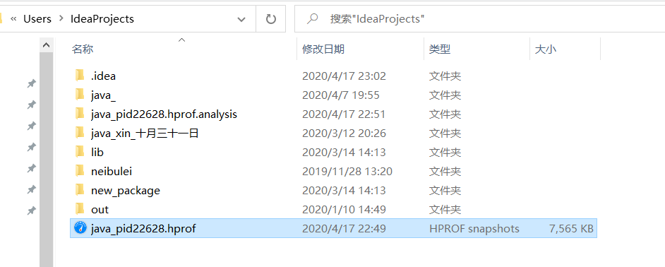
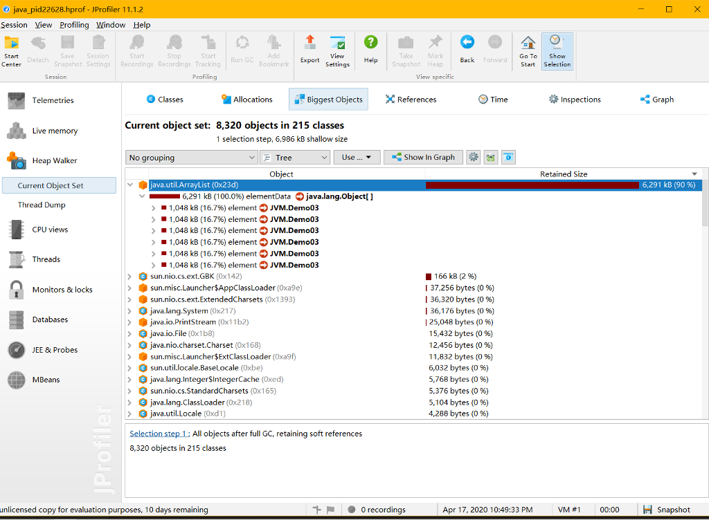

# Jprofiler:

在idea中的配置:

//-Xms设置初始化内存分配大小

//-Xmx设置最大分配内存

//-XX:PrintGCDetails打印gc清理内存的信息

//-XX:+HeapDumpOnOutOfMemoryError栈溢出(OOM)的信息

//-Xms1m -Xmx8m -XX:+HeapDumpOnOutOfMemoryError

 

运行及结果:

他会生成一个.hprof的文件,在project目录下即可找到,

使用jprofiler打卡,可以查看内存状态

查看:

 

