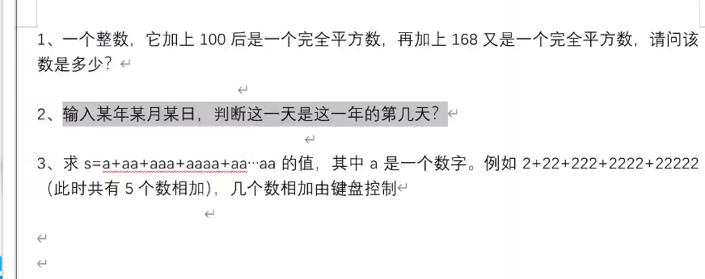

# Linux光盘,U盘挂载

光盘挂载：

#mkdir /mnt/cdrom

#建立挂载点

 
#mount -t iso9660 /dev/cdrom/mnt/sdrom/

#挂载光盘

 
#mount /dev/sr0/mnt/cdrom/

 
光盘卸载：

#umount设备文件名或挂载点

 
#umount /mnt/cdrom

 
U盘挂载：

#fdisk -l

#查看U盘设备文件名

 
#mount -t vfat /dev/sdb1 /mnt/usb/

注意：Linux默认是不支持NTFS文件系统的

 
 

