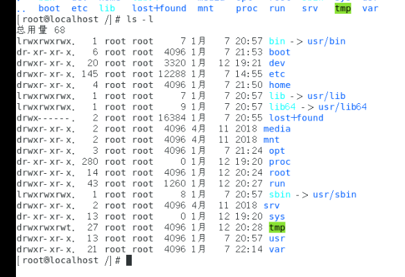
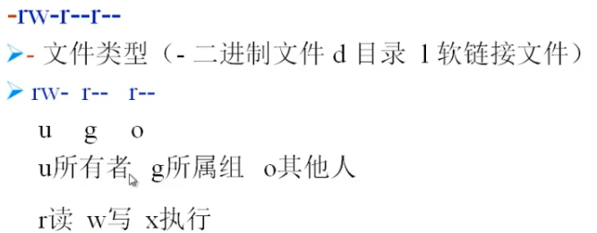

# Linux文件在-l下显示的含义

最前面出现的数字代表文件存储方式,了解即可

第一个root代表所有者(所有者,谁创建了显示谁),可以有u(user),g(group),o(other)

Linux中所有者和所属组只能各有一个,其他的都属于其他人

第二个root代表所属组

第五个数字代表大小,单位可以为字节,

第六个为文件最后修改时间

第七个为文件名

Linux终端中常见的三种

显示如果以-开头,则为文件

d开头,则为目录

l开头,则为软连接

 

 

 

 

 

 

