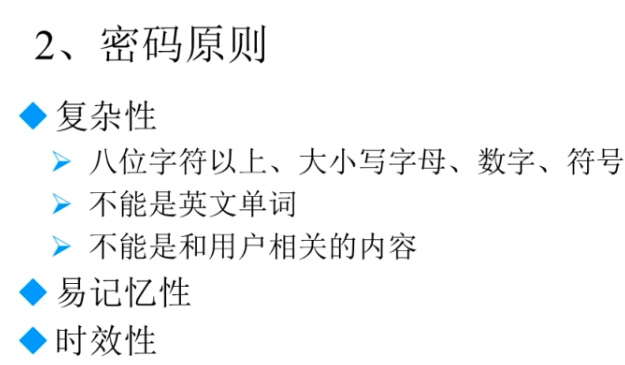

# Linux欢迎界面

Install or upgrade an existing system:安装或升级现有系统

Install system with basic video driver:安装过程采用基本的显卡驱动

Rescue installed system:进入系统修复模式

Boot from local driver:退出安装从硬盘启动

Memoryteat:存储介质检测

