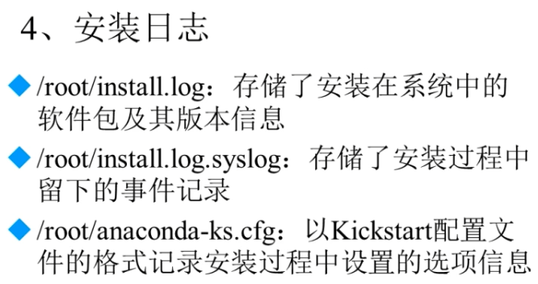

# Linux软件包选择

Desktop(桌面)

Minimal Desktop(最小化桌面)

Minimal(最小化)服务器安装推荐

Basic Server(基本服务器)

Database Server(数据库服务器)

Web Server(网页服务器)

Virtual Host(虚拟主机)

Software development workstation(软件开发工作站)

