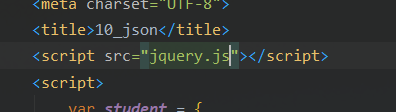
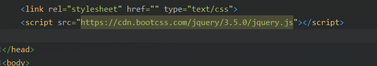

# jQuery

* JavaScript和jQuery:

    * jQuery就是封装了大量JavaScript的工具的库
    * 获取jQuery:

        * 在jQuery的官网下载jQuery的网页:

        * 或者搜索CDN jQuery的网址连接(CDN引入):

* 选择器:
  
        * 对比:
    
* 事件action:
	* 鼠标事件:
    
            * mousedown()按下
            * mouseleave()离开
            * mousemove()移动
            * mouseover()点击结束
* 键盘事件
* 其他事件
  
    * 操作DOM:
    
        * $('#test_ulli[name=python]').text();//获得值
        * $('#test_ul li[name=python]').text('123456');//设置值
        * $('#test_ulli[name=python]').html();//获得值
        * $('#test_ulli[name=python]').html('<strong>123</strong>');//设置值

* css的操作::

    * $('#test_ulli[name=python]').css("color","red");//使用键值对设置

* 元素的显示和隐藏:

    * $('#test_ulli[name=python]').hide();//隐藏
    * $('#test_ulli[name=python]').show();//显示

        * 本质:display:none

 

 

 
