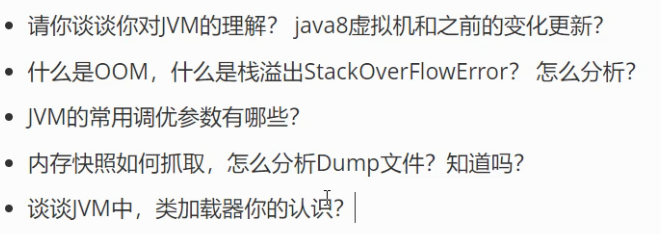

# jvm初步:

* 请你谈谈对jvm的认识,java8虚拟机和之前的变换更新?

* 什么是OOM,什么是栈溢出Stack Overflowerror?怎么分析?
* jvm的常用调优参数有哪些?
* 内存快照如何抓取?怎么分析dump文件?知道吗?
* 谈谈jvm中,类加载器你的认识?

 

* 1.jvm的位置
* 2.jvm体系结构
* 3.类加载器:

    * 作用:加载class文件

* 4.双亲委派机制:

    * 为了安全,
    * app >exc  >BOOT(最终执行)

        * 1.类加载器收到类加载的请求,
        * 2.将请求向上委托给父类加载器去完成,一直向上委托,直到启动类加载器
        * 3.启动类加载器会检查是否能够加载这个类,能加载就使用当前的加载器,找不到了抛出异常,通知子加载器进行加载
        * 4.重复步骤3

            * Class Not Found
            * null:java调用不到或者不存在,因为java底层是C写的

* 5.沙箱安全机制:
* 6.native
* 7.pc寄存机制:
* 8.方法区:
* 9.栈
* 10.三种jvm
* 11.堆
* 12.新生区,老年区
* 13.永久区
* 14.堆内存调优
* 15.GC

    * 1.常用算法

* 16.jmm
* 17.总结
字节码校验器(bytecode verifier):确保Java类文件遵循Java语言规范。这样可以帮助Java程序实现内存保护。但并不是所有的类文件都会经过字节码校验,比如核心类。

类装载器(class loader):其中类装载器在3个方面对ava沙箱起作用:

它防止恶意代码去干涉善意的代码; //双亲委派机制,

它守护了被信任的类库边界;

它将代码归入保护域,确定了代码可以进行哪些操作,

虚拟机为不同的类加载器载入的类提供不同的命名空间,命名空间由一系列唯一的名称组成,每一个被装载的类将有一个名字,这个命名空间是由Java虚拟机为每一个类装载器维护的,它们互相之间甚至不可见

类装载器采用的机制是双亲委派模式。

1,从最内层VM自带类加载器开始加载,外层恶意同名类得不到加载从而无法使用;

2,由于严格通过包来区分了访问域,外层恶意的类通过内置代码也无法获得权限访问到内层类,破坏代码就自然无法生效

存取控制器(access controller):存取控制器可以控制核心APl对操作系统的存取权限,而这个控制的策略设定,可以由用户指定。

安全管理器(security manager):是核心API和操作系统之间的主要接口。实现权限控制,比存取控制器优

先级高

安全软件包(security package): java.security下的类和扩展包下的类,允许用户为自己的应用增加新的安全特性,包括:

安全提供者

消息摘要

数字签名keytools

加密

鉴别

程序计数器: Program Counter Register

每个线程都有一个程序计数器,是线程私有的,就是一个指针,指向方法区中的方法字节码(用来存储指向像一条指令的地址,也即将要执行的指令代码) ,在执行引擎读取下一条指令,是一个非常小的内存空间,几乎可以忽略不i

Method Area方法区

方法区是被所有线程共享,所有字段和方法字节码,以及一些特殊方法,如构造函数,接口代码也在此定义,简单说,所有定义的方法的信息都保存在该区域,此区域属于共享区间;

静态变量、常量、类信息(构造方法、接口定义)、运行时的常量池存在方法区中,但是实例变量存在堆内存中，和方法区无关

 

1.百度

2.思维导图

 

单点登录---SSO

 
