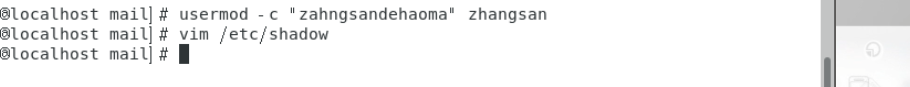
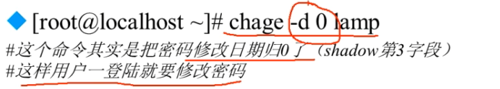

# usermod,chage

#usermod [选项]用户名

-u修改用户的UID

-c用户说明：修改用户的说明信息

-G组名：修改用户的附加族

-L：临时锁定用户

-U：解锁用户锁定

Charge【选项】用户名

-l:列出用户的详细密码状态

-d日期：修改密码最后一次更改日期（shadow3字段）

-m天数：两次密码修改间隔（4字段）

-M天数：密码有效期（5字段）

-W天数：密码过期前警告天数（6字段）

-I天数：密码过后宽限天数（7字段）

-E日期：账号失效时间（8子段）

InkNode is not supported例子：

