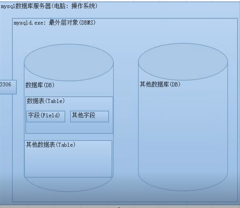

# 什么是数据库

1.What:

Database,存储数据的仓库

专业定义:高效地存储数据和处理数据的介质(主要分为两种:磁盘(存储空间)和内存Ram)

2.数据库分类:

数据库基于介质不同,分为两类:关系型数据库(SQL)和非关系数据库

(NoSQL: Not  Only  SQL,不是关系型的数据库都叫做非关系型数据库)

3.不同的数据库阵营中产品有哪些?

大型:Oracle,DB2

中型:SQL-SERVER,Mysql等

小型:access等

非关系型数据库:memcached,mongodb,redis(同步到磁盘)

4.阵营的区别?

关系型数据库:安全(保存磁盘基本不可能丢失),容易理解,比较浪费空间(二维表)

非关系型数据库:效率高,不够安全(断电丢失)

关系型数据库

1.What?

关系型数据库是一种建立在关系模型(数学)上的数据库,

关系模型:一种所谓的建立在关系上的模型,关系模型包含三个方面:数据结构:数据存储的问题,二维表(有行和列结构);SQL操作指令集合:所有SQL语句;完整性约束:表内数据约束(字段与字段),表与表之间约束(外键)

2.关系型数据库的设计?

关系型数据库据:从需要存储的数据需求中分析,如果是一类数据(实体)应该设计成一张二维表,表是由表头(字段名:用来规定数据的名字)和数据(实际存储的数据单元)部分组成

二维表:行和列

|表头|字段名|字段名2|
|---|---|---|
|数据单元|数据1|数据2|

关系型数据库:维护实体内部,实体与实体之间的联系

实体内部联系

 

关键字说明:

数据库:database

数据库系统:DBS(Database System):是一种虚拟系统,将多种内容关联起来的称呼

DBS=DBMS+DB

DBMS: Database  Management System,数据库管理系统,专门管理数据库

DBA: Database  Administrator,数据库管理员,专门管理数据库

行/记录:row/record,本质是一个东西,都是指表中的一行(一条记录):行是从结果角度出发,记录是从数据角度出发

列/字段:column/field,本质是一个东西

SQL(关系型数据库操作指令集合)

SQL: Structured Query Language,结构化查询语言(数据以查询为主:99%是在进行查询操作)

SQL分为三个部分

DDL: Data Definition Language,数据定义语言,用来维护存储数据的结构(数据库,表),

代表指令:creat,drop,alter等

DML: Data Manipulation Language ,数据操作语言,用来对数据进行操作(数据表中的内容),代表指令:insert,delete,update等:其中DML内部又单独进行了一个分类:DQL(Data Query Language:数据查询语言,如:select)

DCL: Data Control Language,数据控制语言,主要是负责权限管理(用户),代表指令:grant,revoke等

SQL是关系型数据库的操作指令,SQL是一种约束(类似于W3C):不同的数据库产品(如:Oracle,mysql)可能内部会有一些细微区别.

Mysql数据库

Mysql数据库软件是一种c/s结构的软件:客户端/服务端,若想访问服务器必须通过客户端(服务端一直运行,客户端在需要使用时运行)

交互方式:

1.客户端连接认证;连接服务器,认证身份:mysql.exe -hPup

2.客户端发送SQL指令

3.服务器接收SQL指令:处理SQL指令:返回操作结果

4.客户端接收结果:显示结果

5.断开连接(释放资源:服务器并发限制)

服务器对象:

没有办法了解服务器内部的内容,只能粗略地去分析数据库服务器地内部结构

将MySQL服务器内部对象分为四层:系统(DBMS),数据库(DB),数据表(Table),字段(Field)

 

 

 

 

 

 

 

 

 

 

 

 

 

 

 

 

 

 

 

 

 

 

 

 

 
