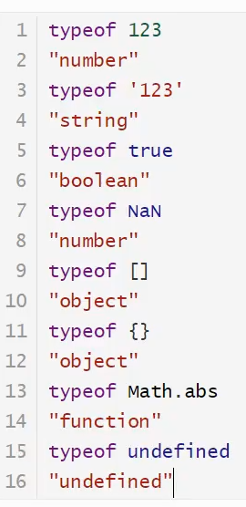

# 内部对象:

*  
    * 标准对象:

        * 

    * Date:
    * JSON:
    
        * json是什么:
    
            * 轻量级数据交换语言..............,
            * 早起所有的数据传输使用XML传输
            * BSON来源于json
    
        * 在JavaScript中一切皆为对象,如何js支持的类型都可以用json来表示
    
            * 对象用{}
            * 数组用[]
            * 所有的键值对:key:value
    
        * json和JavaScript的转换:
        * json和js对象的区别:
    
            * var obj={a:'hello',b:'hello'};
            * var json='{"a"='hello',"b":'hellob'}'

    * Ajax:
    
        * 原生的js写法xhr异步请求
        * jQuey封装好的方法: $("#name").ajax("")
        * axios请求
    
    *  

varnow=newDate();

now.getFullYear();//年

now.getMonth();//月0到11代表月

now.getDate();//日

now.getHours();//时

now.getDay();//星期几

now.getMinutes();//分

now.getSeconds();//秒

now.getTime();//时间戳全世界统一1970,1,1,00:00到现在的毫秒数

console.log(newDate(1586863128595));//时间戳转本地时间

now.toLocaleString();//转为本地时间注意调用是一个方法,不是属性

varuser={

name:'qinjiang',

age:3,

sex:'nan'

}

//对象转化为json字符串:

varjsonuser=JSON.stringify(user);

//json字符串转为对象:参数为json字符串

varobj=JSON.parse('{"name":"qinjiang","age":3,"sex":"nan"}');

 

 
