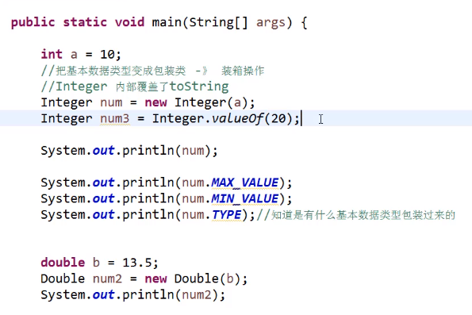

# 包装

 

将int包装成Integer的语法

输出num却会输出10,因为其内部已经定义了一个toString

用MAX_VALUE可以查看这个num中允许的最大值

MIN_VALUE可以看最小值

TYPE可以查看类型

有两种包装操作:

Integer内部覆盖了toString

int类型可以转为String类型,但是""里面必须是数字,不是数字会被报错

Integer.toBinaryString(i);将i转为二进制的形式

返回值用二进制参数表示无符号整数值的字符串表示形式

创建一个double类型的包,注意前面的double的D是大写的.

后面的.SIZE代表double的位数

int a=6;

Integer num=new Integer(a);

Integer num2=new Integer(20);

拆箱操作:把包装类的对象转换为对应的基本数据类型

其中num3为基本数据类型

num2包装类型,

而且num3的基本数据类型点不出MAX_VALUE

num2点的出来

一个拆箱的例子:

装箱和拆箱

 

 

 
