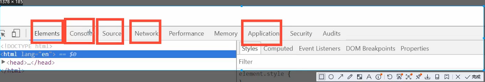

# 基本语法

 
浏览器调试必备:

 
 

 
数据类型:

* 数值,文本,图像,音频......
 
* 变量:

    * 使用var关键字,不能以数字开头,可以以$,_符号或者中文开头

* number:

    * JavaScript不区分小数和整数,但是number

        * 123(整数),123.1(小数),1.123e3(科学计数法),-99(负数),Nan(not a number),Infinity(极大的数,表示无限大)

* 字符串:

    * 'abc',"abc"

* 布尔值:

    * true,false

* 与或非

    * &&
    * ||:一个为真,结果为真
    * !:取反

* 比较运算符:

    * =赋值
    * ==等于(类型不一样,值一样,也会判断为true)
    * ===绝对等于(必须类型一样,值一样,结果为true)

        * 须知:NaN与所有的数值都不想等,包括自己,只能通过isNaN(NaN)这个方法来判断这个数是不是NaN

 
 
* 浮点数问题:

    * console.log((1/3)===(1-2/3))
    * 尽量避免使用浮点数去计算,会有精度损失
    * Math.abs(1/3-(1-2/3))<0.000000001

 
 
 
* null和undefined

    * null(空)
    * undefined(不存在的值)

* 数组

    * 一系列相同类型的对象
    * JavaScript中可以这样
//保证代码的可读性,尽量用中括号

vararr=[,3,13,6,6,6,56,'hello',true,null]

newArray(1,3,6,54,656,2)

    * 如果取超过数组的值,只会给出undefined

* 对象

    * 大括号扩起来
    * 每个属性之间使用逗号隔开,最后一个不需要添加
    * 取对象的值:

* 数组:

    * 数组使用中括号扩起来

 
person.name

"qingjiang"

person.age

3

 
 
 
* 严格检查模式:

    * 'use strict';
 

 
 
 
* str.toUpperCase():字符串转换为大写
