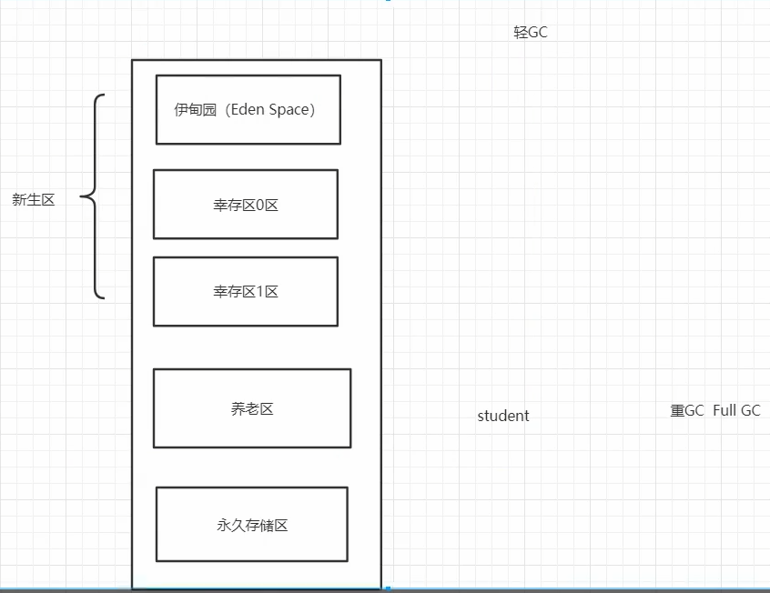
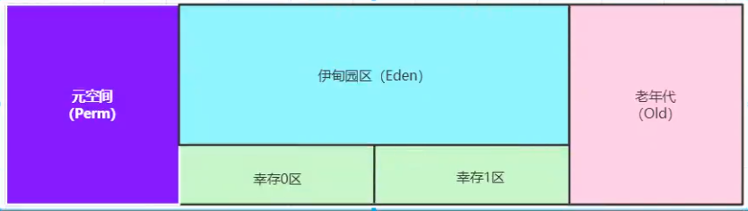

# 堆:

三种jvm:

* sun公司HotSpot(学习这个)
* BEA公司Jroctit
* IBM公司J9VM jit编译器
 
堆:Heap

* 一个jvm,只有一个堆内存,堆内存的大小是可以调节的.
* 类加载器读取了类文件后,一般将什么文件放入堆中呢?类,方法,常量,变量;保存我们所有引用类型的真实对象
* 堆内存中细分为三个区域:

    * 新生区(伊甸园区:Eden Speace) Young,New
    * 养老区Old
    * 永久区Perm

Gc垃圾回收,主要是在伊甸园区和养老区

假设内存满了,OOM,堆内存不够(当你无限new对象时可能发生)

 
在JDK8以后,永久存储区改了个名字:元空间

 
 
新生区(99%的对象都活不到养老区):

* 类:诞生和成长的地方,甚至死亡;
* 伊甸园区:所有对象都是伊甸园区new出来的
* 幸存者区: (0,1)
 
真理:99%的对象都是临时对象!

 
 
 
 
永生区:常驻内存的,用来存放JDK自身携带的class对象,interface对象,存储的是java运行时的一些环境,该区域不存在垃圾回收,关闭虚拟机就会释放这个区域的内存,

一个启动类加载了大量的jar包,tomcat部署了太多的应用,或者大量动态生成的反射类,不断地被加载永生去就可能会崩溃(OOM)

* JDK1.6之前:永久代,常量池在方法区之中
* JDK1.7:永久代,但是慢慢地退化了,去永久代,常量池在堆中
* JDK1.8之后:无永久代,常量池在元空间
 

元空间:逻辑上存在,物理上不存在,它属于堆

 
 
在一个项目中突然出现了OOM故障,那么此时该怎么办?

研究为什么会出错:

* 能够看到代码第几行错误,内存快照分析,MAT,Jprofiler
* Dubug,一行一行分析代码
*  

 
MAT,Jprofiler作用:

* 分析Dump内存文件,快速定位内存泄漏
* 获得堆中的数据
* 获得大的对象
 
 
GC的作用区域就只用方法区和堆

 
jvm在进行垃圾回收时:并不是对这三个区域统一回收.大部分时候,回收但是新生代

* 新生区
* 幸存区(from区,to区)
* 老年区
 
 
GC两种类:轻GC(普通GC),重GC(全局GC)

* GC题目:

    * JVM的内存模型和分区~详细到每个区放什么
    * 堆里面的分区有哪些?Eden,from,to,老年区,说说他们的特点?
    * GC算法有哪些?标记清除法,标记压缩,复制算法,引用计数器(每个对象引用一次就记一次数,计数器本身也会有消耗),怎么用的?
    * 轻GC和重GC分别在什么时候发生?
    *  

 
 
 
 
 
