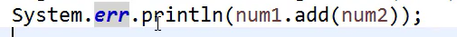

# 常用类_BigDecimal

 
float,double都可以表示小数,但是不精确

因此要用到

BigDecimal:

计算金钱时用到这个

err将输出以红色的颜色输出,起到提醒的作用

![BigDecimal 

public (double Val) 
将 a “ b 转 为 0 艹 艹 ] ， 过 罡 a 。 ub 的 二 过 制 浮 点 伯 的 確 十 进 制 衷 示 。 
返 回 的 0 均 0 “ “ 《 10 一 ． 、 “ 1 》 罡 一 个 整 的 品 小 伯 。 
记 ： 
3 ． 
1 、 构 這 函 纣 訁 果 可 有 些 不 可 司 以 假 设 在 Ja “ 中 巪 入 n 宀 g 灬 10 ． 河 创 一 个 g 艹 1 ， 它 莞 全 等 干 0.1 （ 非 标 尺 值 为 ， 比 莎 的 1) 。 但 0 示 上 等 于 
灬 。 。 艹 。 。 。 艹 。 。 。 艹 555H15 “ 3 № 578 “ “ 118 巧 834 叫 54m 嗎 6 。 罡 因 为 。 、 环 競 像 。 ub “ （ 或 者 1 乍 为 任 1 刂 有 阳 长 虔 二 进 割 分 数 ） 精 暗 地 表 示 。 因 此 ， 正 在 0 # : 构 造 的 值 不 罡 正 好 等 于 o 山 虽 然 表 面 上 ． 
苡 “ n i 乱 在 另 一 万 面 。 罡 弃 全 可 满 以 的 ： 卵 艹 1 1 《 " 。 过 習 a 刂 畔 艹 1 艹 1 这 正 于 。 山 正 如 人 所 望 的 那 样 。 因 此 ， 一 貯 僻 议 使 用 “ 四 “ tru 宀 r 先 于 此 。 
当 u 须 用 0 漁 为 卵 1m 彐 10 三 意 ， 眦 這 提 供 了 一 个 韬 碚 的 啦 ； 它 不 会 丬 。 吡 1 《 为 s “ Ing 用 D 。 吡 1 亠 “ “ 四 。 u 匕 “ 》 万 怯 。 然 后 使 用 g 艹 1 《 “ 四 } 构 這 函 相 同 扌 果 。 奘 茯 得 该 结 果 。 谲 使 用 
Static valueOf 《乸0记匕1@》 万 》 去 
如 果 “ 1 是 无 限 或 № 
《 ： = ep 上 10n ](images/9a6aaf56-1da9-4605-8422-c79717adb88e.png)使用BigDecimal时想要精确,就需要把输入类型转化为String类型

如下图:

在输入的数据加上引号,输出为:

 

BigInteger

两个long类型的数字相加,加不出来,因此要用到BigInteger,这个用的很少很少

