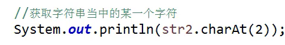

# 常用类_char类型转String等常用类

![char[] , 'b' 
String str=new Stri ng(cs) ; 
System. out . pri ntln(str) ; ](images/cabb00c2-1f63-4572-a0a4-8f70a0e0ee55.png)将char类型的cs转为String类型

反过来也是可以的

 

将String类型的数组str转化为char类型的cs2数组

返回子字符串在字符串中第一次或最后一次出现的位置

