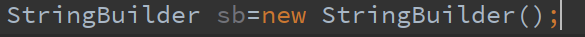
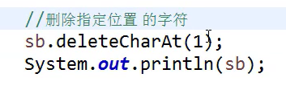
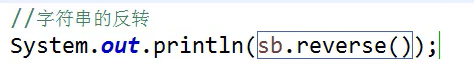

# 常用类_字符串

可变字符串的性能高一些

字符串分类:.

1.不可变字符串:定义好之后,就不能再去改变了(内存地址不可变)

2.可变字符串:定义好之后,还可以进行修改:修改时,不会创建新的地址

 
可变字符串又分为两种:

StringBuilder:没有synchronized,所以其效率会更高一些

StringBuffer:方法前面多了一个synchronized加锁的意思,加锁更安全

速度:String <StringBuffer< StringBuilder

其初始容量是16,如果超过,会自动扩容

StringBuilder中输出其长度

而且其自动扩容是扩大二倍再加二

![976- 

977 
978 
979 
980 
981 
982 
983 
984 
985 
986 
987 
988 
989 
99ø 
991 
992 
993 
994 
9 95 
public 
if 
if 
boolean equals (Object anobject) { 
(this anobject) { 
return true; 
(anobject instanceof String) { 
String anotherstring = (String) anobject; 
int n = value. length; 
if (n anotherString. value. length) { 
char VIC] value; 
char v2[] 
= anotherstring.value; 
int i = e; 
while (n- 
if (vi[i] v2[i]) 
return false; 
return true; 
return false; 
2. Y'JString3é!V4 ](images/be2643ff-6d01-4bb8-a7dd-0796b117f2e6.png)
