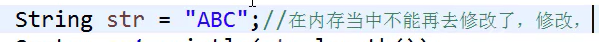

# 常用类_相等的几个东西

 
字符串分类:.

1.不可变字符串:定义好之后,就不能再去改变了(内存地址不可变)

2.可变字符串:定义好之后,还可以进行修改:修改时,不会创建新的地址

 
可变字符串又分为两种:

StringBuilder

StringBuffer

 
字符串的本质:

是一个char类型的数组

 
一个不可变字符串:

在内存当中不能再修改,修改,就会创建新的地址

 
 

equalis比较的时,先比较个数据地址相不相等,如果不相等

,再去判断两数据的类型是否是String,再逐字比较字符串的每一个是否相等

而==是直接比较地址

开发中一般使用equalis

忽略大小写的比较:equalsIgnoreCase()

