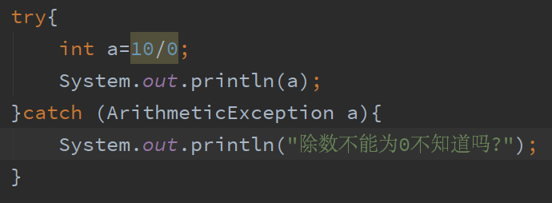

# 异常

异常

异常概述

异常处理方式:

1.自己处理,然后继续运行

2.自己没有办法处理,交给JVM处理

自己处理异常:

try…catch…finally

Try…catcn处理多个异常

编译时异常与运行时异常

常用方法

throws方式处理异常

throw与throws的区别

finally

基本格式:

try{

可能出现异常的代码

}catch(异常类型){

}finally{

处理完异常最后做的处理

}

Try:用来检测异常

Catch:用来捕获异常

Finally:释放资源

 

如：

try {

int i = 10/0;

System.out.println("i="+i);

} catch (ArithmeticException e) {

System.out.println("Caught Exception");

System.out.println("e.getMessage(): " + e.getMessage());

System.out.println("e.toString(): " + e.toString());

System.out.println("e.printStackTrace():");

e.printStackTrace();

}

原文链接：https://blog.csdn.net/qq_44057443/article/details/89606732

InkNode is not supported