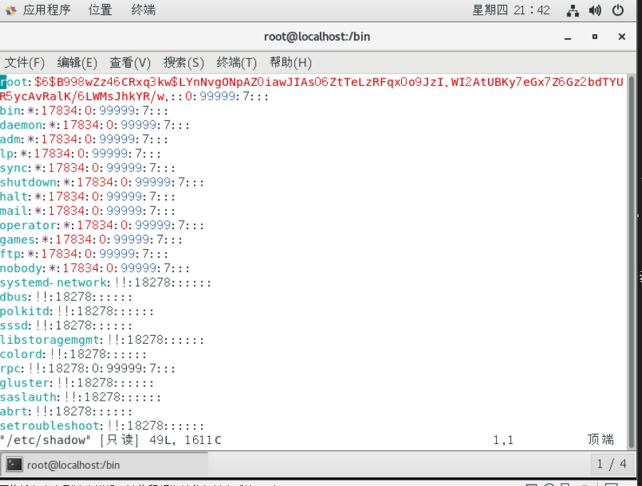

# 影子文件

影子文件

/etc/shadow

其实是psswd的

第一字段:用户名

第二字段:加密密码

加密算法升级为SHA512散列加密算法

如果密码位是"!!"或"*"代表没有密码,不能登录

第三字段:密码最后一次修改日期

使用1970年1月1日作为标准时间,每过一天时间戳加1

第四字段:两次密码的修改时间间隔(和第三字段相比)

第五字段:密码有效期(和第三字段相比)

第六字段:密码修改到期前上的警告天数(和第五字段相比)

第七个字段:密码过期后的宽限天数(和第五个字段相比)

0:代表密码过期后

-1:则代表密码永远不会失效

第八字段:账号失效时间,

要用时间戳表示

第九字段:保留

 
 
 
 
 
 
 
 
 
 
