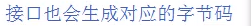
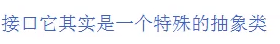

# 接口

接口:一种规范

 
 
![接 0 只 定 义 了 类 应 当 逗 循 的 规 范 ， 却 不 关 心 
这 些 类 的 内 部 数 据 和 其 功 能 的 实 现 细 忙 站 
在 程 序 角 度 上 说 接 「 ] 只 规 定 了 类 里 必 须 提 供 
的 方 法 ， 从 而 分 离 了 烟 范 和 实 现 ， 增 强 了 系 
统 的 可 拓 展 性 和 可 维 护 性 。 ](images/090de88e-df59-4f00-bf5d-5dd73226a6f3.png) 

 

接口对应着实现类

 
内部的abstract可以省略不写,

如果没有在方法面前加abstract,在编译时会自动添加上

