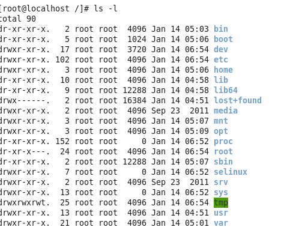
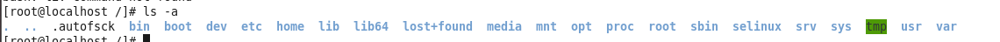
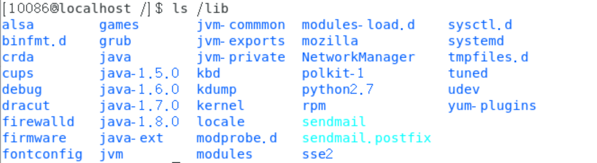

# 文件处理命令_ls命令

用法1:ls指令

含义:(ls)list,列出当前目录下的所有文件和文件夹的名称

用法2:路径

列出指定目录下的文件或文件夹的名称

用法3:#ls选项路径

含义:在列出路径下文件/文件夹的名称.并以指定格式来经行显示

常见的:

#ls -l路径

-l表示list,以长列表的形式展示

,展示的信息较为齐全

例如:

 

#ls -a路径

表示显示所有的文件/文件夹,包括隐藏文件和隐藏文件夹

例如:

 

用法4:#ls-h

含义:列出指定路径下的所有文件/文件夹/的名称,以列表的形式显示在文档大小时以可读性较高的形式来显示

用法5:#ls-I

查询当前文件目录的i节点

关于路径(重要)

路径可以分为两种,相对路径,绝对路径

在Linux中1绝对路径是"/"

./表示当前目录下,"../"是表示上一级目录

Linux中隐藏文件都是以.开头

目录下,淡蓝色为文件,深蓝色为文件夹

Linux中显示目录大小都是4k,但它的大小并非4k

Ls-d:显示指定目录本身

 

只是针对目录查看它的详细信息,并不查看其数据

第一个数字(2,5,7之类的)代表该文件的存储方式

第一个root代表所有者,所有者有三种,root,用户组,other

第二个root代表该文件的所属组

第五项为文件大小

第六项为文件最后一次修改时间

InkNode is not supported 
