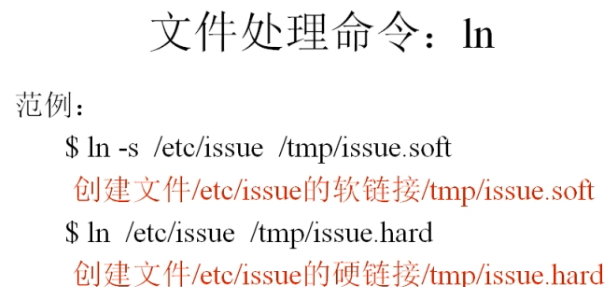

# 文件处理命令_链接命令_ln

命令所在目录:/bin/ln

执行权限:所有用户

语法:ln-s[原文件][目标文件]

-s创建软连接

功能:生成链接文件

 

Linux中软链接特点:体积很小,权限为三个rwx,一定有个箭头指向它所对应的文件

硬链接特点:

相当于拷贝cp-p+同步更新

硬链接不能跨分区,但是软连接可以,

硬链接不可以针对目录使用,但是软连接可以

 

在文件最后一行添加

 

判断软硬链接:硬链接的i节点与源文件的i节点一致,而软连接的i节点与源文件的不一致

 

 

 

 
