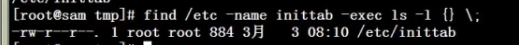

# 文件搜索命令_find

命令所在路径:/bin/fnd

执行权限:所有用户

消耗系统资源有点大

服务器运行高峰期时不要用find命令查看,

在搜索时尽量越精确越好

语法:find[搜索范围][匹配条件]

功能:文件搜索

$ find / -iname int

搜索时忽略大小写区别

$ find /etc  -name init(只有文件名为init的才会被搜索,与Windows不一样)

在目录/etc中查找文件init

-iname不区分大小写

 

$ find /etc -name*init*

在目录/etc中查找文件命中有init的文件

只要文件名中有init就搜索出来

不区分大小写

 

$ find /etc -name init*

查找以init开头的文件

 

$find/etc-nameinit???

在根目录下查找以init开头,后面是三个字母的文件

--------------------------------------------------------

$ find / -size +204800

在根目录下查找大于100MB的文件

+n大于-n小于n等于

linux中一个数据块有512字节0.5k

100MB=1024k=102400kb=204800个数据块

------------------------------------------------------

根据时间属性来查找

$ find /etc -cmin -5(+表示超过多少时间)

在/etc目录下查找五分钟内被修改过属性

的文件和目录

-amin访问时间access

-cmin文件属性change

-mmin文件内容modify

------------------------------------------------------

$find/home-usershenchao

在根目录下查找所属者为沈超的文件

-group根据所属组查找

------------------------------------------------------

$ find /etc -size +163840 -a -size -204800

在/etc目录下查找大于80MB小于100MB的文件

-a:两个条件同时满足(and)

-o:两个条件满足一个即可(or)

$ find /etc -name inittab -exec ls -l{} \;

在/etc下查找inittab文件并显示其详细信息

-exec/-ok命令{}\;对搜索结果执行操作

只是-ok会经行询问

------------------------------------------------------

-type(跟在最后)

根据文件类型查找

f文件d目录l软连接文件

------------------------------------------------------

-inum根据i节点查找

 
