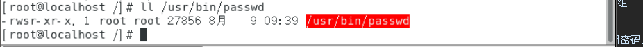
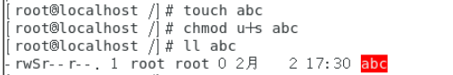
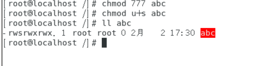

# 文件特殊权限，SetUID

SetUID

功能：

* 只有可以执行的二进制程序才能设定SUID权限
* 命令执行者要对该程序拥有x（执行）权限
* 命令执行者在执行该程序时获得该程序文件属主的身份（在执行程序的过程中灵魂附体为文件的属主）
* SetUID权限只在该程序执行过程中有效，也就是说身份改变只在程序执行过程中有效
* 

（在所有者的权限位置有s，则表示可以有SetUID权限）

* passwd命令拥有SetUID权限，所以普通可以修改自己的密码
* #ll/usr/bin/passwd

* cat命令没有SetUID权限，所以普通用户不能查看/etc/shadow文件内容
* #ll /bin/cat

设定SetUID的方法：

* chmod  4755文件名(4代表SIUD，7：所属者，7：用户组，5：其他人)
* chmodu+s文件名
* 

（此处为大写S，则代表文件赋予SUID失败，因在设定时必须具有可写权限）

（改变为可写权限后成功）

取消SUID

 
